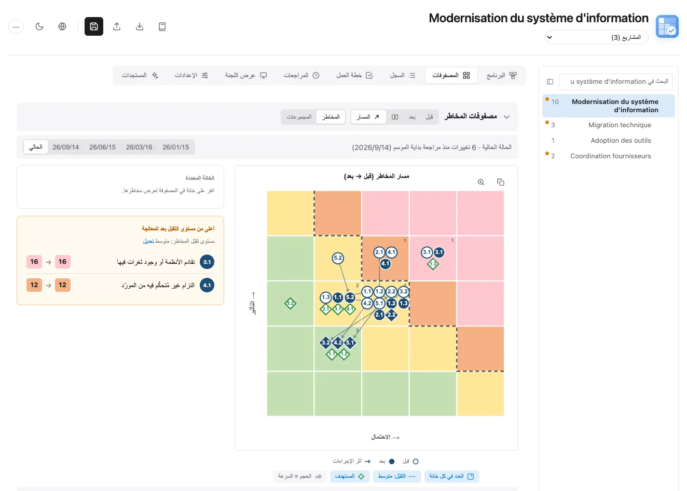
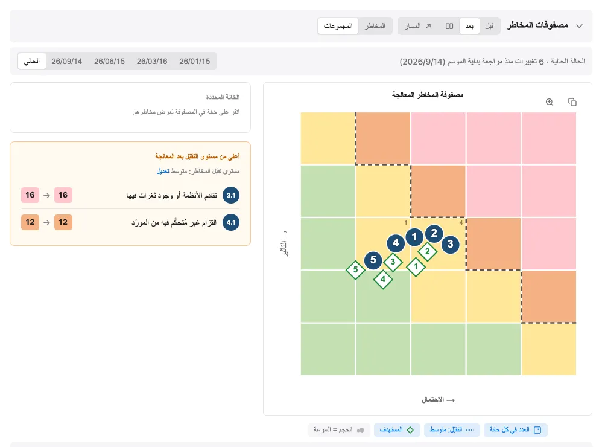
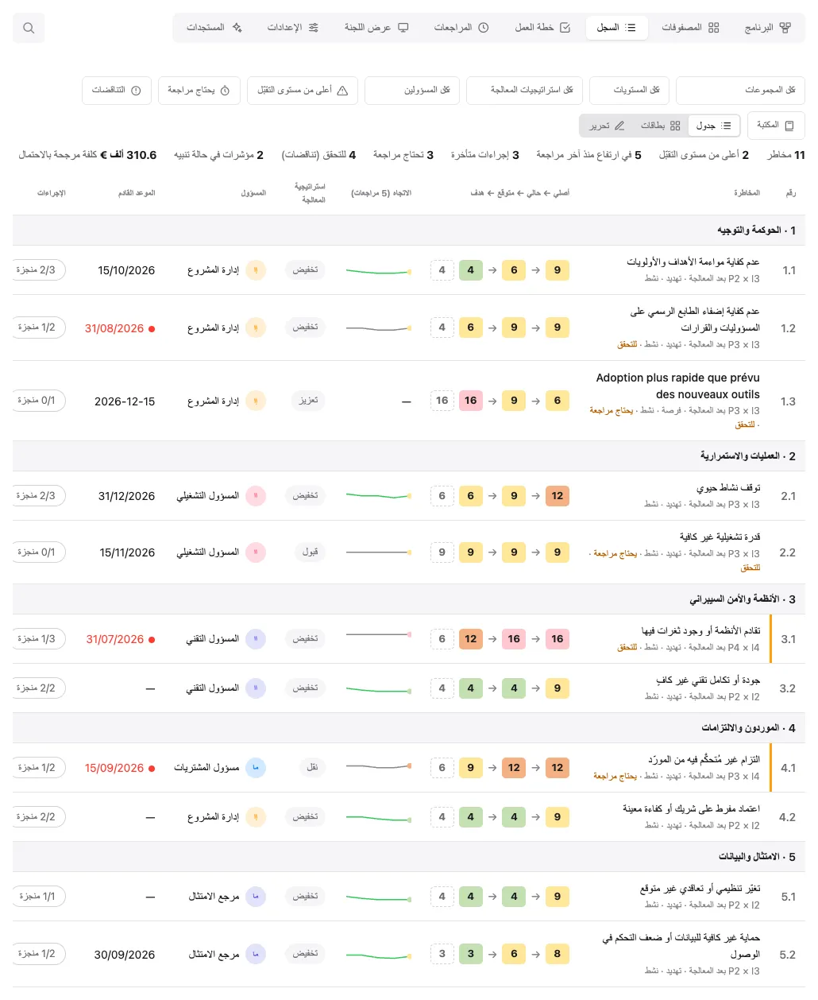
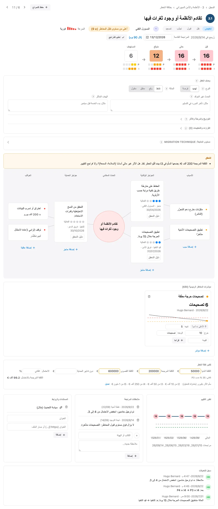
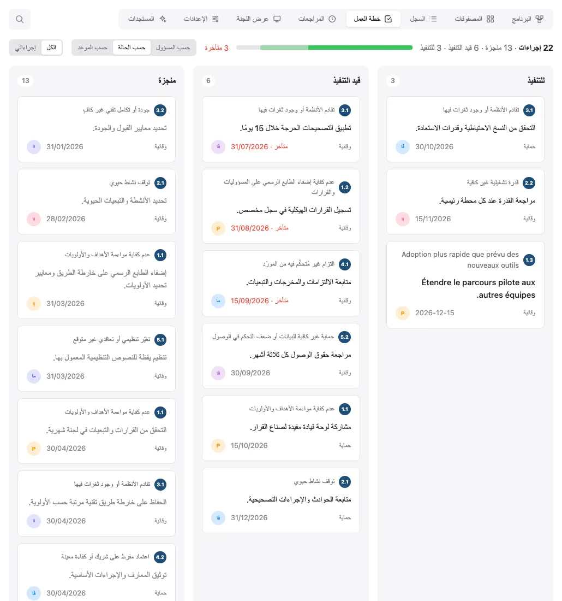
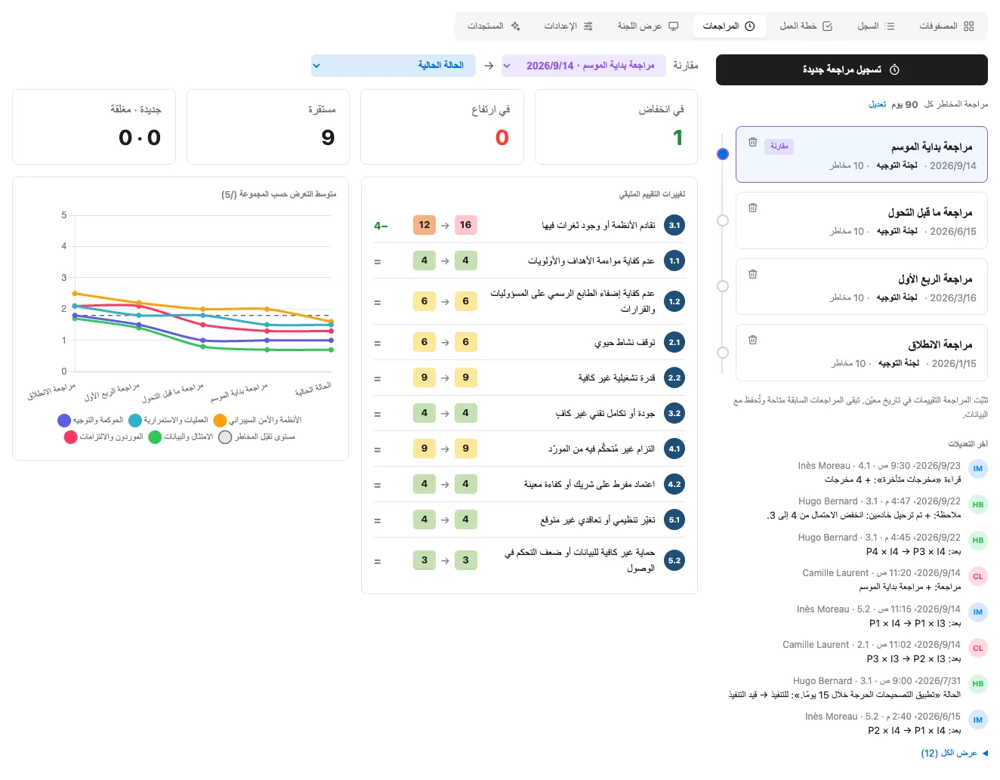
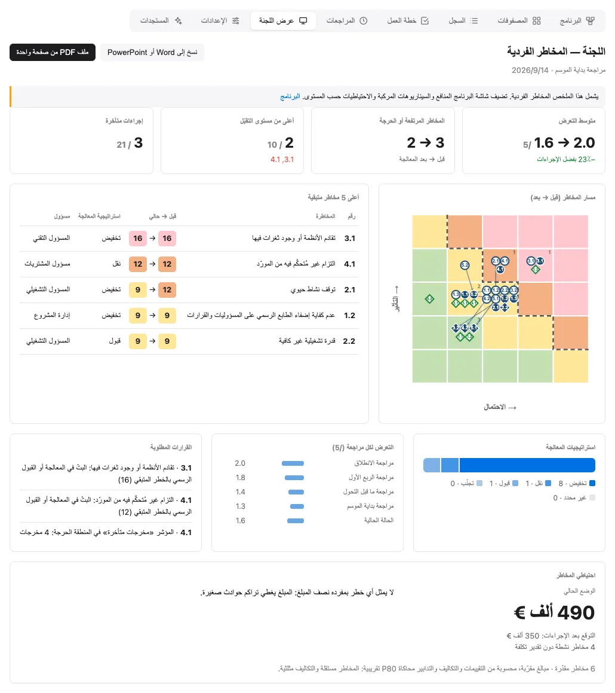
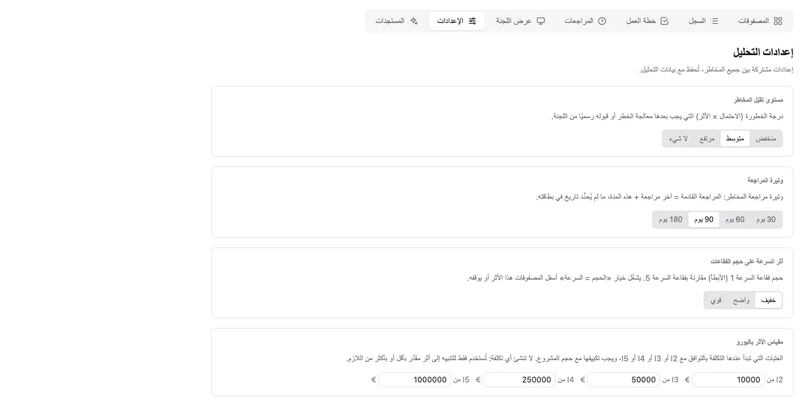
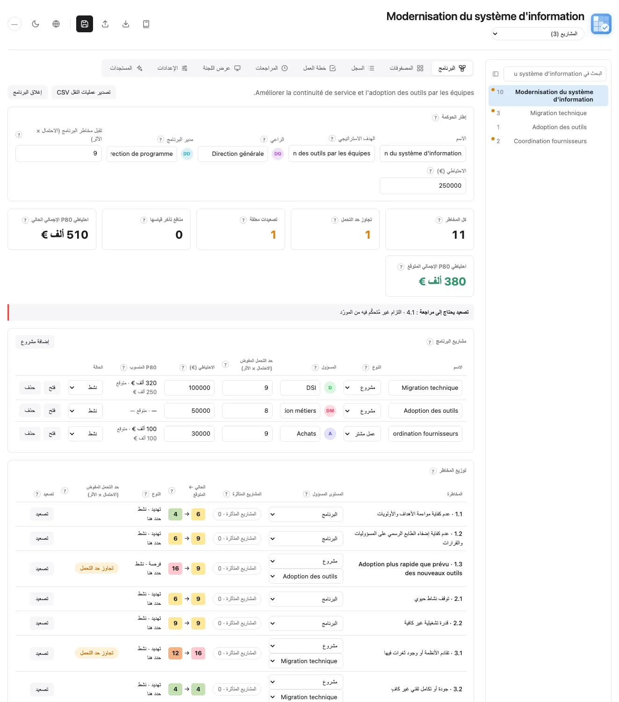
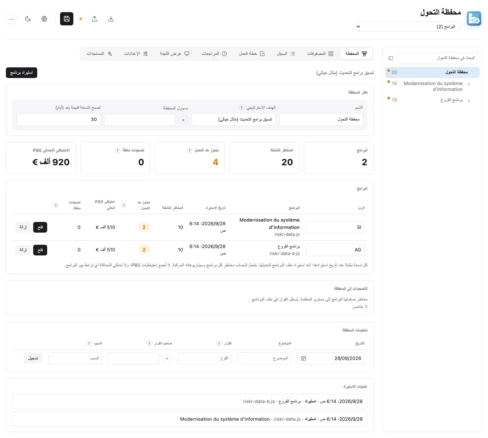

  
  <h1>Riskr</h1>
  
Web application for risk analysis and risk mapping, with before/after matrices and collaborative management.

  <a href="README.md">🇬🇧 English</a> ·
  <a href="README.fr.md">🇫🇷 Français</a> ·
  <a href="README.es.md">🇪🇸 Español</a> ·
  <a href="README.zh.md">🇨🇳 中文</a> ·
  <a href="README.ar.md">🇸🇦 العربية</a>

## 📋 نبذة

**Riskr** تطبيق ويب كامل من صفحة واحدة لتحليل المخاطر وإدارتها. يُظهر كيف تتطور المخاطر قبل وبعد تطبيق إجراءات المعالجة، من خلال مصفوفات تفاعلية وجداول تفصيلية.

## 🖼️ لقطات الشاشة

لقطات الشاشة مأخوذة من بيانات العرض التوضيحي الموجودة في `riskr-data.js`، وهي بيانات
افتراضية بالكامل (برنامج خيالي لتحديث نظام معلومات)، معروضة بالسمة
الفاتحة. لكل نسخة لغوية من هذا الملف لقطات شاشة بلغتها الخاصة
(الواجهة وبيانات العرض التوضيحي مُترجمتان لهذا الغرض، `docs/captures/traductions/`).
لإعادة توليدها بعد تعديل الواجهة: `node docs/captures/generer-captures.mjs` (يتطلب Chrome).
العرض التوضيحي برنامج (مشاريع، وشجرة في الجانب، ومسار تنقل، وبحث)؛ أما لقطة
المحفظة فتُولَّد لحظيًا من العرض التوضيحي نفسه (برنامجان خياليان) دون حفظها.

**المصفوفات**: مسار قبل ← بعد، الهدف (شارة معيّن أزرق = تم بلوغ الهدف، معيّن أبيض
= هدف مرجوّ)، مستوى تقبّل المخاطر، الحالة في تاريخ مراجعة معيّن.

<picture>
  
</picture>

<picture>
  
</picture>

**السجل**: تقييمات الكامن ← الحالي ← المتوقع ← المستهدف، الاتجاه عبر المراجعات،
المعالجة، المسؤول، تاريخ الاستحقاق القادم والإجراءات.

<picture>
  
</picture>

**بطاقة الخطر**: وتيرة المراجعة، مخطط العظم (Bow-Tie) (الأسباب والحواجز
وفعاليتها والعواقب)، مؤشرات المخاطر الرئيسية (KRI) بعتباتها وقراءاتها،
التقدير المالي باليورو، اتجاه التقييم، الملاحظات، الروابط وسجل التعديلات.

<picture>
  
</picture>

**خطة العمل**: الإجراءات حسب الحالة أو المسؤول أو تاريخ الاستحقاق، مع إبراز
العناصر المتأخرة؛ يمكن سحب بطاقة إلى الموضع المطلوب أو إلى عمود آخر لتغيير
حالتها (عرض الحالة) أو مسؤولها (عرض المسؤول).

<picture>
  
</picture>

**المراجعات**: الخط الزمني للمراجعات المسجَّلة، وتيرة المراجعة، آخر التعديلات
الموقّعة، مقارنة حرّة، تغيرات التقييم والتعرّض حسب المجموعة.

<picture>
  
</picture>

**عرض اللجنة**: ملخص من صفحة واحدة (القرارات المنتظرة، مؤشرات المخاطر الرئيسية
الحرجة، احتياطي المخاطر بمحاكاة مونت كارلو)، قابل للنسخ إلى Word أو PowerPoint
وللتصدير بصيغة PDF.

<picture>
  
</picture>

**الإعدادات**: إعدادات مشتركة لكامل التحليل (مستوى تقبّل المخاطر، وتيرة
المراجعة، أثر السرعة على حجم الفقاعات، سلم التأثير باليورو)، مذكَّر بها عبر
رابط "تعديل" أينما استُخدمت.

<picture>
  
</picture>

**البرنامج**: صفحة البرنامج بمشاريعه ومنافعه وتصعيداته واحتياطياته؛ شجرة
«البرنامج › المشاريع» في الجانب مع بحث نصي كامل؛ ومسار التنقل تحت العنوان.

<picture>
  
</picture>

**المحفظة**: عدة برامج مستوردة للقراءة فقط، وملخص لكل برنامج (المخاطر النشطة،
وحدّ التحمل، والاحتياطي، وحداثة النسخة)، والتصعيدات والتحكيمات.

<picture>
  
</picture>

## 📦 بيانات منفصلة (riskr-data.js)

تُخزَّن البيانات في `riskr-data.js` (بصيغة `window.RISKR_DATA`)، ويحمّلها
`riskr.html` تلقائيًا. ملف HTML هو المحرّك وملف البيانات هو المحتوى: بالنسبة
لتحليل جديد، لا يتغيّر سوى `riskr-data.js`.

- **الصيغة القانونية (canonical)**: `risks[]` مسطّحة + `riskGroups[].riskIds`
- **دورة كاملة مضمونة**: يُنتج تصدير JSON وتصدير `riskr-data.js`
  (قائمة التصدير) نفس هذه الصيغة، القابلة لإعادة الاستيراد أو إعادة التحميل
  كما هي بجانب ملف HTML
- بدون `riskr-data.js`، تعرض الصفحة عنصرًا نائبًا بسيطًا (لا توجد بيانات
  نموذجية مخفية داخل HTML)
- عند الفتح محليًا، يمكن لملف `riskr-data.local.js` أن يتجاوز البيانات العامة.
  يُستثنى هذا الملف من Git ويجب ألا يحتوي إلا على بيانات خاصة يُمنع نشرها.

لكل خطر أربعة تقييمات: `assessmentBefore` (الكامن)، و`assessmentCurrent`
(الملاحَظ)، و`assessmentAfter` (المتوقع بعد الإجراءات المفتوحة)، و`assessmentTarget`
(المستهدف)، بصيغة `[probability, impact]` (من 1 إلى 5؛ `[0, 0]` = غير مُقيَّم). الحرجية هي
الاحتمال × التأثير (من 25)؛ تُعرض بمقياس 5 (النتيجة ÷ 5) في الجداول والمصفوفات.
في الملفات القديمة التي تتضمن إجراءات غير منجزة، ينطلق التقييم الحالي احتياطًا
من التقييم الكامن ويُعلَّم للمراجعة.

أسماء حقول البيانات بالفرنسية (اللغة الأصلية للتطبيق):

- `mesures`: قائمة الإجراءات `{ texte, porteur, echeance, etat, verification }` (النص،
  المسؤول، تاريخ الاستحقاق، الحالة؛ المسؤول وتاريخ الاستحقاق اختياريان؛ `etat`
  تكون `todo` أو `doing` أو `done`؛ تُقبل أيضًا سلسلة نصية بسيطة). تاريخ استحقاق
  بصيغة `YYYY-MM-DD` أو `DD/MM/YYYY` تجاوز موعده على إجراء غير منجز يُعلَّم
  كمتأخر.
- `causes`: نصوص مخطط العظم (Bow-Tie)؛ `consequences`: `{ texte, chiffrage }`
  (النص، التقدير المالي؛ تُقبل أيضًا سلسلة نصية بسيطة). لكل إجراء أيضًا
  `barriere` (`prevention` أو `protection`)، أي جانبه من مخطط العظم، و`efficacite`
  (الفعالية، من 0 إلى 5). يحتفظ `rang` (اختياري) بالموضع المختار بالسحب والإفلات
  في خطة العمل؛ وبدون ترتيب، تُرتَّب الإجراءات حسب التأخر ثم تاريخ الاستحقاق.
- `velocite`: السرعة بين وقوع الحدث وظهور تأثيره (من 1 إلى 5، 0 = غير مُقيَّمة)،
  تُستخدم في خيار "الحجم = السرعة" الخاص بالمصفوفات. يسجّل `proximityDate` بشكل
  منفصل موعد احتمال وقوع الحدث؛ ويسمّي `milestone` المرحلة المفصلية المرتبطة.
- يميّز `kind` بين التهديدات والفرص؛ ويقيّم `impactAxes` الآثار على التكلفة
  والجدول الزمني والجودة والخدمة والمنفعة. تسجّل `event` و`objective`
  و`raisedAt` و`raisedBy` الحدث غير المؤكد والهدف المتأثر والمصدر.
- تكون `lifecycle` إحدى القيم `active` أو `materialized` أو `closed` أو
  `transferred`؛ وتحتفظ `lifeDate` و`lifeReason` و`transferOwner` و`issue`
  بتفاصيل الخروج وبالمشكلة الناتجة عند وقوع الخطر.
- تسجّل `decisions` القرارات المؤرخة وصاحب القرار والسبب وتاريخ إعادة النظر
  والنتيجة المقبولة. ويستلزم القبول المنتهي أو الذي تفاقم خطره قرارًا جديدًا.
- `notes`: ملاحظات المراجعة `{ date, auteur, texte }` (التاريخ، الكاتب، النص)؛
  `liens`: الوثائق والروابط `{ libelle, url }` (التسمية، الرابط).
- `settings.templates`: "نماذجي" في المكتبة `{ titre, description, cotation,
  mesures }`.
- `uid`: معرّف داخلي ثابت للخطر (يُنشأ تلقائيًا)، يُستخدم لتتبع خطر من مراجعة
  إلى أخرى رغم إعادة الترقيم.
- `kri`: مؤشرات المخاطر الرئيسية `{ id, nom, unite, sens, alerte, critique,
  releves: [{ date, valeur, auteur }] }` (الاسم، الوحدة، الاتجاه، عتبتا التنبيه
  والحرجية، القراءات)؛ `sens` تكون `hausse` (كلما ارتفعت القيمة ساء الوضع) أو
  `baisse`؛ تحدد آخر قراءة الحالة (أخضر، برتقالي عند عتبة التنبيه، أحمر عند
  العتبة الحرجة).
- `cout`: التقدير المالي `{ min, probable, max, probabilite, sansProtection }`
  — التكلفة باليورو في حال وقوع الخطر (تكفي قيمة واحدة) والاحتمال بالنسبة
  المئوية؛ عند تركه فارغًا، يُستمد الاحتمال من تقييم P بعد المعالجة (من P1 إلى
  P5: 5، 15، 35، 60، 85%). `sansProtection` (اختياري): التكلفة المرجّحة لو وقع
  الخطر دون إجراءات الحماية.
- `revuLe` / `prochaineRevue` (اختياري، `YYYY-MM-DD`): آخر مراجعة معلنة
  والمراجعة القادمة المختارة؛ `settings.cadenceRevue`: مراجعة المخاطر كل N يوم
  (90 افتراضيًا).
- `journal`: سجل التعديلات `{ id, date, auteur, uid, risque, champ, detail,
  avant, apres }`، يُملأ تلقائيًا عند كل تعديل (2000 سطر كحد أقصى). تقترح قائمة
  التصدير خيار "riskr-data.js · بدون سجل" لمشاركة التحليل دون هذه الأسماء
  والأوقات.
- `reviews`: المراجعات المسجَّلة `{ id, date, label, auteur, note, risks: [{ uid, id,
  title, before, after, motif }] }`، لقطات مؤرخة للتقييمات تُستخدم في المقارنات؛ يلخّص `note` المراجعة ويشرح `motif` سبب التقييم.
- `statut` تكون `statusNotTreated` أو `statusInProgress` أو `statusTreated` أو
  `statusAccepted`.
- `traitement` (الاستراتيجية) تكون `reduce` أو `accept` أو `transfer` أو
  `avoid` أو `escalate` للتهديدات، أو `exploit` أو `enhance` أو `share` أو
  `accept` أو `escalate` للفرص، أو `''` (غير محددة)؛ `assessmentTarget` هو التقييم المستهدف
  `[probability, impact]` (`[0, 0]` = غير محدد).
- `settings.riskAppetite`: أقصى نتيجة مقبولة (P × I، من 25؛ `0` = بلا حد).
  القيمة الافتراضية 9، أي أدنى قليلًا من عتبة "المرتفع". تُرسم كخط منقّط على
  المصفوفات؛ ويُشار في السجل إلى أي خطر متبقٍّ يتجاوزها.
- تتبع الأرقام (`1.1`، `1.2`…) موضع المخاطر وتُعاد حسابها عند كل إضافة أو حذف
  أو نقل.
- عتبات الحرجية الافتراضية: منخفضة 1-4، متوسطة 5-9، مرتفعة 10-14، حرجة 15-25.
  تُطبَّق في كل مكان (المصفوفات، الشارات، الجداول) ويمكن تغييرها في
  `appState.criticalityThresholds`، على سبيل المثال
  `{ medium: 5, high: 10, critical: 15 }`.
- متوسط المجموعة هو متوسط حرجية مخاطرها المُقيَّمة، من 5 كما في جدول الملخص.
- يقبل الاستيراد أيضًا صيغًا أقدم: مخاطر مُدرجة داخل مجموعات، تقييمات مزدوجة
  قديمة (`assessmentA*`/`assessmentB*`، `gcBefore`/`dtuBefore`…)، حالات كنص
  ("En cours"…). يُرفض أي ملف غير صالح دون تغيير التحليل المعروض.

يمكن لكل مجموعة أيضًا أن تحتوي على حقلَي ملخص لصناع القرار:

- `assessmentNote`: قراءة موجزة للفئة؛
- `remediationNote`: المعالجة المرتقبة.

يحدّ Riskr هذين النصين بـ 30 كلمة. يبقى المحرك متوافقًا مع ملفات البيانات
الأقدم التي لا تحتوي عليهما.

### إدارة مخاطر البرنامج

ينظّم تبويب **البرنامج** التحليل حول هدف استراتيجي. تبقى الملفات القديمة التي
لا تحتوي على `program` سجلات مخاطر لمشروع واحد. يضم البرنامج **مشاريعه**
(`components`، من النوع `project`، أو `work` لعمل مشترك لا يُعد مشروعًا، مثل
تنسيق الموردين)، و`benefits` و`dependencies` و`scenarios` و`escalations`
و`stages` و`decisions`. وتبقى مجموعات المخاطر **فئات موضوعية**.

يصبح اسم البرنامج عنوان الصفحة (والنقر عليه يعيد إلى الأعلى)؛ وتحته يعرض مسار التنقل المسار «البرنامج › المشروع»؛ ويمكن النقر على كل
مستوى من المسار للصعود إليه. وتنزل القائمة المنسدلة «المشاريع (n)» في نهاية
المسار إلى مشروع؛ ويعيد خيارها الأول إلى البرنامج. يؤدي اختيار مشروع إلى حصر
المصفوفات والسجل وخطة العمل والمراجعات وعرض اللجنة في المخاطر التي يملكها هذا
المشروع أو التي تمسّه. ويتبع التبويب الأول المستوى ويتغير اسمه: **البرنامج**
(صفحة البرنامج مع قائمة مشاريعه) أو **المشروع** (أرقام المشروع والمخاطر التي
يملكها أو التي تمسّه)؛ وينزل زر «فتح» في سطر المشروع إلى مستواه. يتذكر المتصفح
خيار العرض هذا، ولا يُحفظ في التحليل.

يحتفظ كل خطر بمعرّف `uid` ثابت واحد وببطاقة واحدة. يحدد `scopeLevel`
و`componentId` السجل المالك له؛ ويسرد `affectedComponentIds` المشاريع الأخرى
المتأثرة. يظهر الخطر المشترك في عدة عروض، لكنه لا يُحتسب إلا مرة واحدة في
محاكاة الاحتياطي الإجمالي. يسجّل `programOrigin` و`programOriginNote` ما إذا
كان الخطر قد حُدِّد هنا، أو تفرّع من مستوى المؤسسة، أو صُعِّد من مشروع. تستخدم
الروابط المعرّفات الثابتة، وليس الأرقام المعروضة أبدًا.

لكل منفعة قيمة مرجعية وقيمة مستهدفة وقيمة فعلية ومسؤول وتاريخ استحقاق ومخاطر
مرتبطة. القيمة الفعلية الفارغة تعني **بانتظار القياس**، لا الصفر. يُعلِّم حدّ
التحمل المفوَّض المخاطرَ للمراجعة؛ ويبقى التصعيد والقرارات أعمالًا بشرية مؤرخة.
تُعرض احتياطيات المشاريع والبرنامج بشكل منفصل.
يسجّل قرار المتابعة النتيجة الملاحَظة؛ ويظهر تنبيه جديد إذا تفاقم الخطر أو انتقل
إلى سجل مالك آخر.
يبقى التصعيد الذي قبلته المؤسسة مرتبطًا ببطاقته في Riskr حتى نقله صراحةً؛ فهذا
المنتج لا يتضمن سجل مخاطر على مستوى المؤسسة.
تشمل مراجعات المخاطر الموجودة في Riskr أيضًا مخاطر البرنامج؛ وتظهر تواريخ
المراجعات الأخيرة وملاحظاتها في تبويب البرنامج.

تربط الاعتماديات بين مشروعين. تضيف السيناريوهات المركبة **تكلفة إضافية** واحتمالًا
يُدخَلان صراحةً؛ ولا يُقدَّر السيناريو إلا بعد ربط تهديدين نشطين على الأقل. لا
تنمذج محاكاة P80 الارتباط بين الأحداث. ولا يجوز جمع قيم P80 الخاصة بالمشاريع.
تستخدم تقديرات البرنامج 1000 سحب على المستوى الإجمالي و250 سحبًا لكل مشروع
للحفاظ على سرعة استجابة التبويب. قبل الإغلاق، يجب نقل المخاطر النشطة أو التي
وقعت مع تحديد مسؤول وتاريخ وسبب؛ ويمكن تصدير عمليات النقل بصيغة CSV. ويحتفظ
تنسيق البيانات المعياري بجميع بيانات البرنامج.

على الشاشات العريضة، تعرض شجرة في الجانب البرنامج (أو المحفظة) وبرامجه ومشاريعها، مع عدد المخاطر النشطة ونقطة برتقالية إذا تجاوز بعضها حد التحمل. يختار النقر المستوى، ويستعيد كل برنامج أو مشروع التبويب وعوامل التصفية التي تُركت فيه (ويحتفظ المستوى الذي لم يُفتح قط بالعرض الحالي)، وتُغلق البطاقة المفتوحة إن كانت خارج المستوى الجديد. في أعلى اللوحة، يبحث البحث النصي الكامل في المستوى المعروض (المحفظة أو البرنامج أو المشروع): البطاقات والإجراءات والأسباب والنتائج والملاحظات والمؤشرات والروابط والقرارات وأسباب المراجعات وعناصر البرنامج، دون تمييز الحركات أو حالة الأحرف، مع اشتراط وجود كل الكلمات في النص نفسه؛ ويفتح النقر على النتيجة البطاقة أو الصفحة أو المراجعة المعنية (سهما أعلى وأسفل للتنقل، ومفتاح الإدخال للفتح). وعلى جانب التبويبات، يصفّي بحث ثانٍ التبويب المفتوح: السجل وخطة العمل والمراجعات والمستجدات؛ وعند ضيق المساحة يتقلص إلى عدسة تُفتح بالنقر. تمتد اللوحة على كامل ارتفاع الصفحة؛ ويمكن طيها وضبط عرضها بسحب حافتها (نقر مزدوج: العرض الأصلي)، ويتذكر المتصفح هذه الاختيارات.

### إدارة المحفظة

تجمع المحفظة عدة برامج يُحفظ كل منها في ملفه الخاص. يحتوي ملف المحفظة على
`portfolio` (`uid` و`title` و`objective` و`owner` و`staleAfterDays`
و`programs` و`decisions` و`journal`) ولا يتضمن أي مخاطر خاصة به (`risks`
و`riskGroups` فارغتان): عندها ينتقل الملف `riskr.html` نفسه إلى وضع المحفظة.
أما الملف الذي لا يحتوي على `portfolio` فيعمل كما في السابق. تُنشأ المحفظة من
تبويب البرنامج في تحليل لا يتضمن برنامجًا (**إنشاء محفظة**).

يقرأ **استيراد برنامج** ملف `riskr-data.js` الخاص ببرنامج أو تصدير JSON له،
ويحتفظ بنسخة مثبتة منه في `programs` (`uid` البرنامج و`code` و`importedAt`
و`source` و`data`). تؤدي إعادة استيراد البرنامج نفسه إلى استبدال نسخته بعد
التأكيد؛ ويُرفض الملف الذي لا يحتوي على برنامج. لا يقرأ المتصفح المجلدات
الأخرى أبدًا: لا تُحدَّث النسخة إلا باستيراد جديد، ويُنبَّه إلى النسخة التي
يتجاوز عمرها `staleAfterDays` (30 يومًا افتراضيًا). يبقى كل برنامج مالكًا
لبياناته: النسخ للقراءة فقط (يُلغى أي تعديل على خطر مع رسالة توضيحية)؛ ويجري
التصحيح في ملف البرنامج ثم يُعاد الاستيراد.

في العرض الموحّد فقط، تُسبق الأرقام المعروضة برمز البرنامج (مثل `NORD 1.1`)،
وتُسبق المعرّفات الثابتة بمعرّف `uid` البرنامج. يحصر مسار التنقل «المحفظة ›
البرنامج › المشروع» المصفوفات والسجل وخطة العمل والمراجعات وعرض اللجنة؛ ويمكن
النقر على كل مستوى من المسار للصعود إليه، وتنزل القائمة «البرامج (n)» أو
«المشاريع (n)» في نهاية المسار مستوى واحدًا (ويعيد خيارها الأول إلى المستوى
الأعلى). ويصبح التبويب الأول **المحفظة** (قائمة البرامج) أو **البرنامج** (صفحة
للقراءة فقط للبرنامج المستورد: مشاريعه وتصعيداته وقراراته) أو **المشروع**؛ وينزل
زر «فتح» في سطر البرنامج أو المشروع إلى مستواه.

يعرض تبويب البرنامج، الذي يصبح اسمه **المحفظة**، ملخصًا لكل برنامج (الرمز،
وتاريخ الاستيراد، والمخاطر النشطة، والمخاطر التي تتجاوز حدّ التحمل، وP80،
والتصعيدات المعلّقة) واحتياطيًا إجماليًا P80 محاكًى على مجموع البرامج: لا
تُجمع قيم P80 الخاصة بكل برنامج، ولا يُنمذَج أي ارتباط بين البرامج. ويعرض
للقراءة فقط تصعيدات البرامج إلى مستوى المؤسسة (يُتخذ القرار في ملف البرنامج)،
وتحكيمات المحفظة (التاريخ، والموضوع، والقرار، وصاحب القرار، والسبب)، وسجل
عمليات الاستيراد. وتُدرج مراجعات البرامج موسومةً برمز البرنامج؛ ولا يمكن تسجيل
مراجعة جديدة من المحفظة.

## 🔌 يعمل دون اتصال بنسبة 100%

جميع المكتبات (chart.js 4.4.0، jsPDF 2.5.1، jspdf-autotable 3.8.2،
xlsx 0.18.5) مُدمجة داخل ملف HTML: لا اعتماد على أي CDN، وتعمل الصفحة بالكامل
دون شبكة (ملف واحد بحجم نحو 2 ميغابايت).

## ✨ الميزات

### تخطيط بعلامات تبويب
- **المصفوفات** (المصفوفات، اللوحة الجانبية، المتوسطات حسب المجموعة، جدول
  الملخص)، **السجل** (جدول مضغوط، بطاقات أو تحرير كامل)، **خطة العمل**،
  **المراجعات**، **عرض اللجنة**، **الإعدادات**، **المستجدات** (سجل التغييرات
  منذ الإصدار الأول، مع روابط إلى الالتزامات (commits))؛ يُحفظ التبويب المختار
  ويظهر في العنوان (`riskr.html#revues`، `riskr.html#fiche:…`)؛ تنقل أزرار
  الرجوع/التقدم في المتصفح بين تبويب وآخر أو بطاقة خطر وأخرى دون مغادرة
  الصفحة. النقر على خلية في المصفوفة يُصفّي السجل واللوحة الجانبية.
- **بطاقة الخطر** (بالنقر على خطر، العنوان `riskr.html#fiche:<uid>`):
  تقييمات قبل ← بعد ← الهدف، المعالجة، المسؤول، السرعة، مخطط العظم المرتبط
  (فعالية الحواجز، التقدير المالي للعواقب)، اتجاه التقييم، ملاحظات المراجعة،
  الوثائق والروابط، "حفظ كنموذج".
- لا تزال النسخة القديمة ذات الصفحة الواحدة متاحة عبر وسم Git `v-une-page`.

### إدارة المخاطر
- **تحرير مباشر (inline)** لجميع الحقول (العناوين، الأوصاف، الفئات)
- **إضافة/حذف** المخاطر ومجموعات المخاطر
- **السحب والإفلات** لإعادة ترتيب المخاطر
- **ترقيم تلقائي** حسب الموضع (إضافة، حذف، سحب وإفلات)
- **إجراءات المعالجة** مع مسؤول وتاريخ استحقاق اختياري وحالة (للقيام،
  قيد التنفيذ، منجزة)؛ تُعرض التواريخ المتأخرة باللون الأحمر
- **خطة العمل**: التقدم، إجراءات مُجمَّعة حسب الحالة أو المسؤول أو تاريخ
  الاستحقاق، "إجراءاتي"، وسم الوقاية/الحماية، إبراز المتأخر أولًا، سحب وإفلات
  البطاقات: يُحفظ الترتيب داخل العمود، مع تغيير الحالة (عرض الحالة) أو
  المسؤول (عرض المسؤول)
- **هوية مُعلَنة**: شارة أعلى اليمين (الأحرف الأولى، لون ثابت لكل اسم، "—" في
  حال عدم الإفصاح). الاسم اختياري؛ ويُطلب عند أول تعديل من كل جلسة طالما لم
  يُدخل (لا يُطلب عند التصفح فقط)؛ يُحفظ في المتصفح، ويوقّع سجل التعديلات
  ويعبّئ مسبقًا كاتب الملاحظات والمراجعات. لا يوجد أي تحقق: الأمر تصريحي بحت.
- **سجل التعديلات**: من غيّر ماذا ومتى (التقييمات، المعالجة، المسؤول،
  الإجراءات، الملاحظات…)، في بطاقة الخطر، وبالنسبة لكامل التحليل، في تبويب
  المراجعات ("آخر التعديلات")؛ يحذف التراجع (Undo) أيضًا السطر المطابق
- **مؤشرات المخاطر الرئيسية (KRI)**: في بطاقة الخطر، قياسات كمية لكل خطر
  بعتبتَي تنبيه وحرجية، وقراءات مؤرخة وموقَّعة، ومخطط مصغّر (sparkline)؛ عداد
  "مؤشرات في حالة تنبيه" في السجل، ومؤشرات حرجة ضمن القرارات المنتظرة في عرض
  اللجنة
- **التقدير المالي واحتياطي المخاطر**: نطاق تكلفة لكل تهديد نشط في البطاقة،
  وفي عرض اللجنة (وملف PDF) **احتياطي P80 الحالي** وتوقّعه بعد الإجراءات.
  تُستبعد الفرص والمخاطر المغلقة؛ وتُحتسب التهديدات النشطة التي لا تكلفة لها
  على حدة. يُولَّد النص تلقائيًا من التقييمات والتكاليف والإجراءات، دون أي
  مصطلحات إحصائية: الحالة العادية (لا وقوع لأي خطر كبير)، ثم لكل خطر كبير
  تكلفته في حال وقوعه، وأثر إجراءاته (احتمال "فرصة واحدة من 3 ← فرصة واحدة من
  7" للوقاية، تكلفة مخفَّضة للحماية) وتقدمها. تُحسَب من 10000 محاكاة مونت
  كارلو (توزيع مثلثي، نتائج مستقرة). يفترض النموذج أن المخاطر مستقلة؛ ولا يقدّر
  الارتباطات ولا السيناريوهات المركبة.
- **كاشف التناقضات**: تنبيهات "للتحقق" (لا شيء يُحظر) عند خروج احتمال مُدخَل
  عن نطاق تقييم P، أو عندما لا تتطابق تكلفة مع تقييم التأثير وفق سلّم اليورو
  الخاص بالتحليل (`settings.echelleImpact`، يُحدَّد في تبويب الإعدادات)، أو
  عندما يكون مؤشر KRI حرجًا على خطر مُقيَّم كمستبعَد، أو عند تناقض التقييمات
  فيما بينها؛ عداد وتصفية في السجل، والتفاصيل في البطاقة
- **وتيرة المراجعة**: لكل خطر مراجعة قادمة (تاريخ مختار، وإلا آخر مراجعة +
  وتيرة 30 أو 60 أو 90 أو 180 يومًا تُحدَّد في تبويب الإعدادات، وتُذكَّر بها في
  تبويب المراجعات وفي البطاقة)؛ "تعليم كمُراجَع" في البطاقة؛ تُعلَّم المخاطر
  المستحقة للمراجعة ويمكن تصفيتها في السجل؛ تذكيرات تُصدَّر بصيغة `.ics`
  (Outlook، Google Calendar، Calendar)
- **دمج ملفين** (قائمة الاستيراد › "دمج ملف…"، JSON أو `riskr-data.js`):
  تعاون خفيف متعدد المستخدمين. تُقارَن المخاطر عبر معرّف ثابت؛ يحتفظ خطر عُدِّل
  على الجانبين بالنسخة التي يكون فيها آخر تعديل (في سجل التعديلات) الأحدث،
  وإلا فالنسخة المحلية (مع الإبلاغ عن التعارض)؛ تُدمَج الملاحظات والروابط
  والقراءات والمراجعات وسجل التعديلات دون تكرار. ملخص للتأكيد قبل التطبيق،
  قابل للتراجع (Cmd+Z)
- **مسؤول قابل للتعديل في كل مكان**: النقر على شارة المسؤول (السجل، خطة
  العمل، البطاقة) يفتح نفس المنتقي مع اقتراحات وشارات، ويتيح أيضًا إنشاء
  مسؤول جديد
- **المراجعات**: لقطة مؤرخة للتقييمات ("تسجيل مراجعة جديدة"، الكاتب أو
  اللجنة)، خط زمني، مقارنة مراجعتين أو مراجعة مع الحالة الراهنة (عدّادات،
  تغيرات مرتّبة حسب الفارق)، منحنى متوسط التعرّض حسب المجموعة واتجاه لكل خطر
- **استراتيجية المعالجة** (تخفيف، قبول، تحويل، تجنّب) و**التقييم المستهدف**
  لكل خطر
- **مرشِّحات**: البحث، المجموعة، المستوى المتبقي، المعالجة، المسؤول، المخاطر
  فوق مستوى التقبّل
- **تصنيف** ضمن مجموعات موضوعية
- **مخطط العظم (Bow-Tie)** لكل خطر: الأسباب، الحواجز الوقائية، الحدث المخشي،
  حواجز الحماية، العواقب (الحواجز هي إجراءات الخطر)
- **مكتبة مدمجة للمخاطر النموذجية** (دون اتصال، 6 مواضيع، 5 لغات، وصف وتقييم
  نموذجي) و"نماذجي": تُضاف بنقرات قليلة، مع الإجراءات المقترحة أو دونها
- **عرض اللجنة** (تبويب): ملخص من صفحة واحدة (المؤشرات، المسار، أعلى 5 مخاطر
  متبقية، المعالجات، التعرّض حسب المراجعة، القرارات المنتظرة)، قابل للنسخ إلى
  Word أو PowerPoint وللتصدير كملف PDF من صفحة واحدة

### التمثيل البصري
- **مصفوفات قبل/بعد** باستخدام Chart.js
- **مصفوفات قبل، بعد، جنبًا إلى جنب أو المسار**: في عرض المسار، ينتقل كل خطر
  من موضعه قبل (فقاعة مفرَّغة) إلى موضعه بعد (فقاعة ممتلئة)
- **مصفوفات في تاريخ مراجعة معيّن**: يعرض خط زمني أسفل الترويسة الحالة
  الراهنة ("تغيير واحد منذ المراجعة رقم 5") أو أي مراجعة سابقة، للقراءة فقط؛
  وتتبعها المصفوفات واللوحة والجداول. يبقى عرض اللجنة وتصدير PDF على الحالة
  الراهنة.
- **العرض**: سطر أسفل المصفوفات يحمل كل خيار فيه رمز مفتاحه (العدد لكل خلية،
  التقبّل بمستواه المحدد في تبويب الإعدادات، الهدف كمعيّن أخضر، حجم الفقاعة
  حسب السرعة، بأثر خفيف أو ملحوظ أو قوي يُحدَّد في الإعدادات؛ شرح عند التحويم)
- **اللوحة الجانبية**: المخاطر في الخلية المنقور عليها وتلك فوق مستوى التقبّل
- **الهدف**: شارة معيّن أزرق = تم بلوغ الهدف؛ معيّن أبيض بحدود خضراء عند
  تقييمه = هدف مرجوّ لم يُبلَغ بعد
- **تقبّل المخاطر** مرسوم كخط منقّط، **عدد المخاطر لكل خلية** (خيارات العرض)،
  النقر على خلية لتصفية السجل
- عرض مقارن لأثر المعالجة
- المتوسطات حسب مجموعة المخاطر
- قراءة ملخصة ومعالجة حسب المجموعة
- مفتاح تفاعلي بترميز الألوان
- نسخ جدول الملخص إلى Word، مع ألوان التقييم
- نسخ مصفوفة كصورة (العنوان، المصفوفة والمفتاح) للصقها في مكان آخر

### السجلّ التاريخي
- **تراجع/إعادة (Undo/Redo)** حتى 50 خطوة (Cmd+Z / Cmd+Y على Mac،
  Ctrl+Z / Ctrl+Y على Windows/Linux)
- يُسجَّل كل تعديل (تقييم، نص، حالة، إضافة، حذف، نقل، استيراد)

### استمرارية البيانات
- **الحفظ في الملف**: في Chrome/Edge، بالنقر على "الحفظ في الملف" مرة واحدة،
  يُكتَب بعدها كل تعديل تلقائيًا في `riskr-data.js` (أو `riskr-data.local.js`
  إذا كان التحليل قادمًا من الملف الخاص). في Firefox/Safari، يُنزِّل زر "حفظ"
  الملف لاستبداله بجانب `riskr.html`. يُظهر مؤشر الحالة، ويطلب تأكيدًا عند
  إغلاق الصفحة في حال وجود تعديلات غير محفوظة.
- **التخزين المحلي (localStorage)**: يُحفظ كامل التحليل أيضًا في المتصفح عند
  كل تعديل ويُستعاد عند إعادة التحميل
- إذا تغيّر `riskr-data.js` بين فتحتين، **يأخذ الملف الأسبقية** وتُهمَل
  التعديلات التي أُجريت في المتصفح (تظهر رسالة بذلك): يجب التصدير قبل
  استبدال الملف
- **تصدير/استيراد JSON** للمشاركة والنسخ الاحتياطي
- لا حاجة إلى أي اتصال بخادم

### الواجهة
- **تصميم متجاوب (Responsive)** للهاتف واللوحي وسطح المكتب
- **أقسام قابلة للطي** لتسهيل التصفح
- **تحرير مباشر** سلِس مع استجابة بصرية
- **سمتان فاتحة وداكنة**: تتبعان إعداد النظام، وتُبدَّلان عبر أيقونة
  الشمس/القمر (يُحفظ التفضيل في المتصفح). تبقى نسخ الصور وملف PDF بالسمة
  الفاتحة
- **أوامر بأيقونات** (استيراد، تصدير، حفظ، اللغة، السمة)، مع تسميات في
  تلميحات الأدوات
- **5 لغات**: الفرنسية، الإنجليزية، الإسبانية، العربية (من اليمين إلى اليسار)
  والصينية. يستخدم PDF الإنجليزية للعربية والصينية (خطوط jsPDF اللاتينية)

## 🚀 الاستخدام

**Riskr تطبيق من صفحة واحدة** - ملف HTML واحد مكتفٍ ذاتيًا.

1. نزّل `riskr.html`
2. افتح الملف في متصفحك
3. هذا كل ما في الأمر! لا حاجة إلى أي تثبيت

## 🛠️ التقنيات المستخدمة

### الواجهة الأمامية
- **HTML5** - بنية دلالية (Semantic)
- **CSS3** - أنماط حديثة مع flexbox/grid
- **JavaScript (ES6+)** - جافاسكريبت خام، دون اعتماد على أي إطار عمل

### المكتبات
- **Chart.js** - تمثيل مصفوفة المخاطر بصريًا
- لا يوجد أي اعتماد خارجي آخر

### استمرارية البيانات
- **localStorage** - تخزين أصلي في المتصفح، معزول لكل تحليل
- صيغة JSON للاستيراد والتصدير

### البنية
- **تطبيق من صفحة واحدة** - كل شيء في ملف HTML واحد
- لا حاجة إلى أي أداة بناء (build) أو تجميع (bundler)
- يعمل دون اتصال بمجرد تحميله

## 📄 الترخيص

هذا المشروع مرخَّص بموجب **رخصة جنو Affero العمومية الإصدار 3.0
(AGPL-3.0)**.

### ملخص الترخيص
- ✅ حرّية الاستخدام والتعديل والتوزيع
- ✅ الشيفرة المصدرية متاحة وقابلة للتعديل
- ⚠️ **مهم لخدمات SaaS**: إذا شغّلت Riskr على خادم يمكن الوصول إليه عبر
  الشبكة (SaaS)، يجب عليك مشاركة الشيفرة المصدرية المعدَّلة مع مستخدميك

راجع ملف [LICENSE](LICENSE) للتفاصيل.

## 🤝 المساهمة

المساهمات مرحّب بها!

1. اعمل Fork للمشروع
2. أنشئ فرعًا لميزتك (`git checkout -b feature/AmazingFeature`)
3. سجّل تعديلاتك (`git commit -m 'Add some AmazingFeature'`)
4. ادفع الفرع (`git push origin feature/AmazingFeature`)
5. افتح طلب سحب (Pull Request)

## 📞 الدعم

لأي سؤال أو اقتراح:
- افتح [issue](https://github.com/guthubrx/Riskr/issues)
- راجع التوثيق في الشيفرة المصدرية

---

© 2025 Riskr — تطبيق تحليل المخاطر ورسم خرائطها

