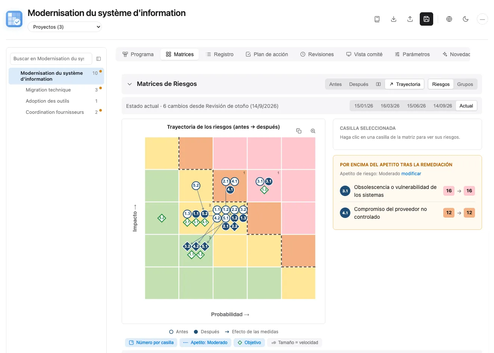
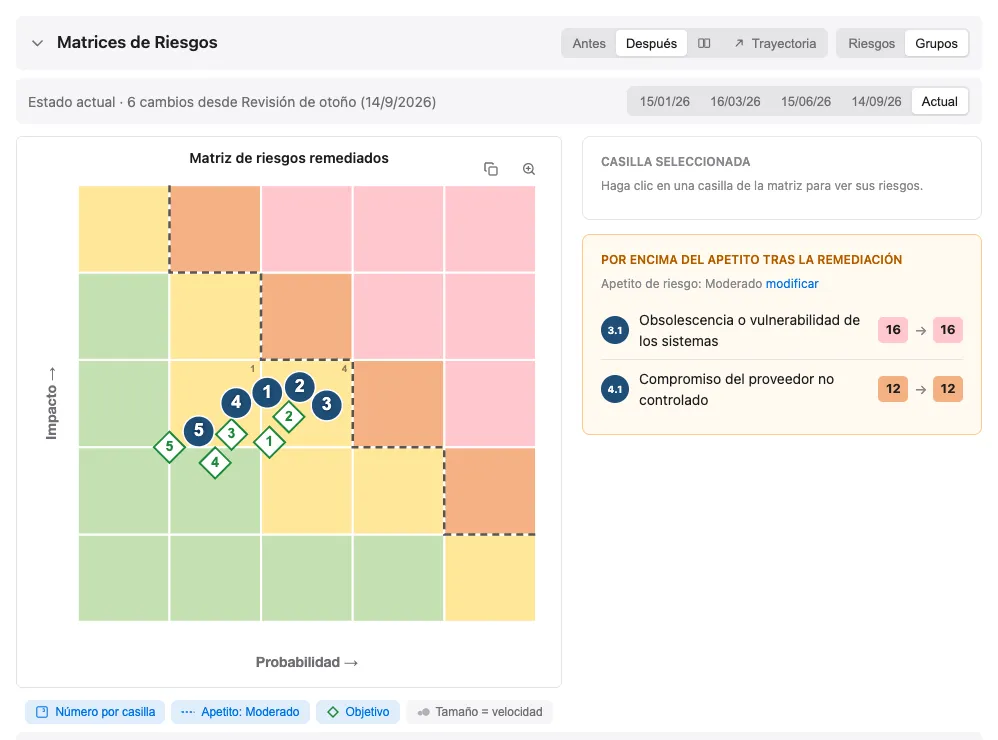
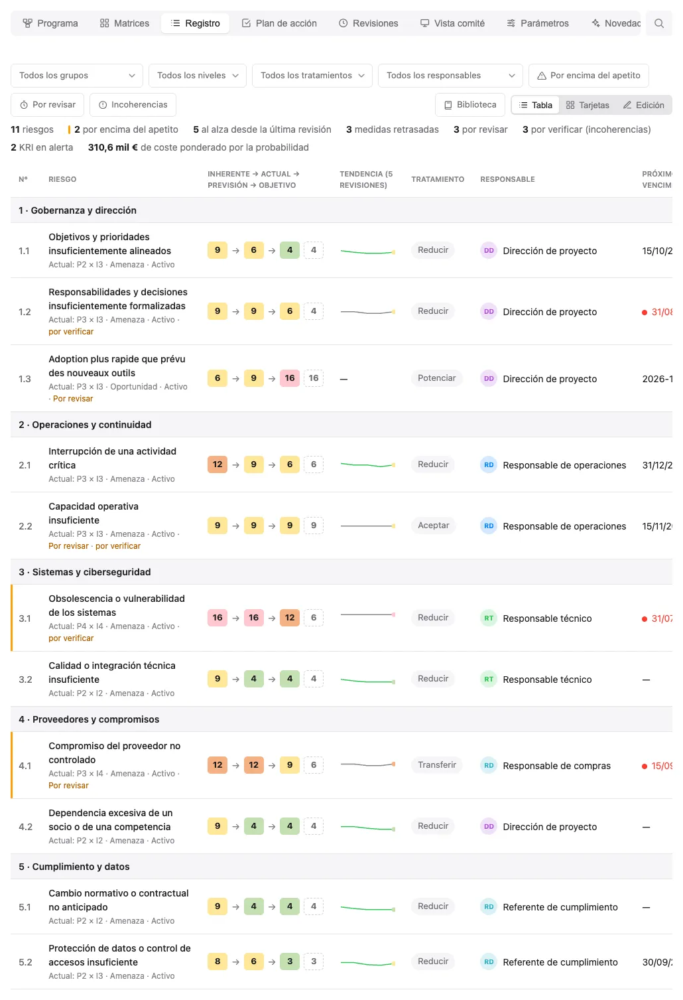
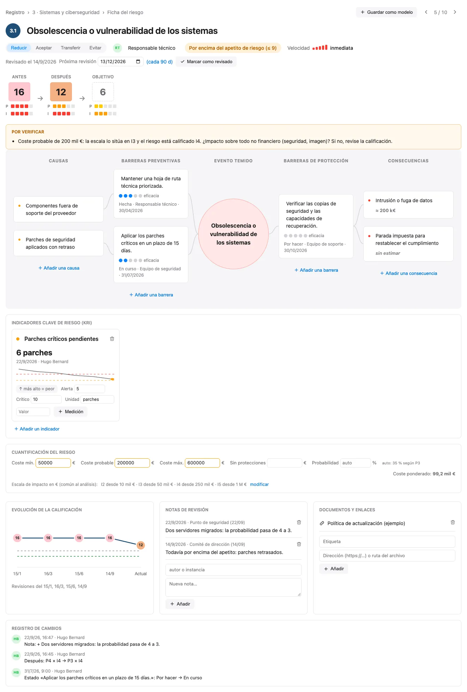
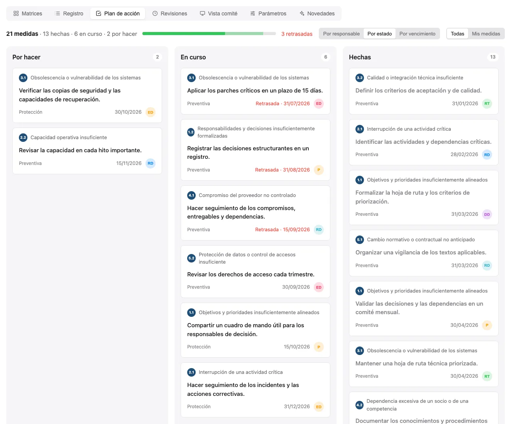
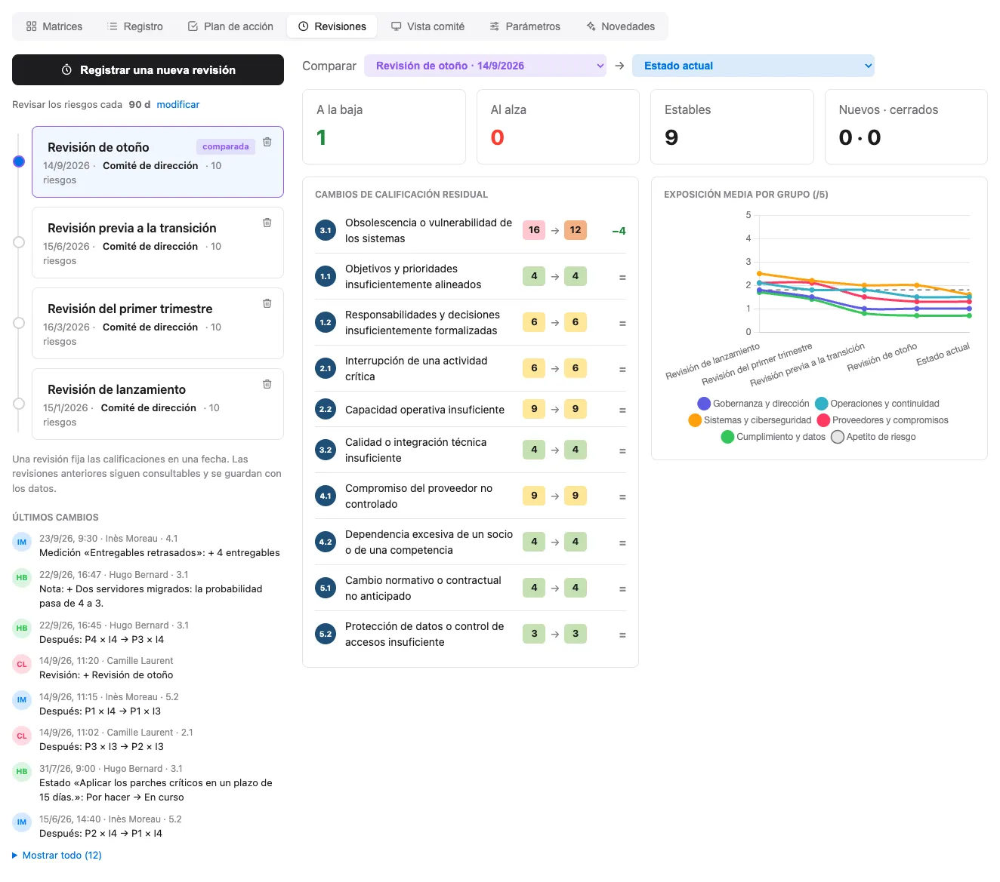
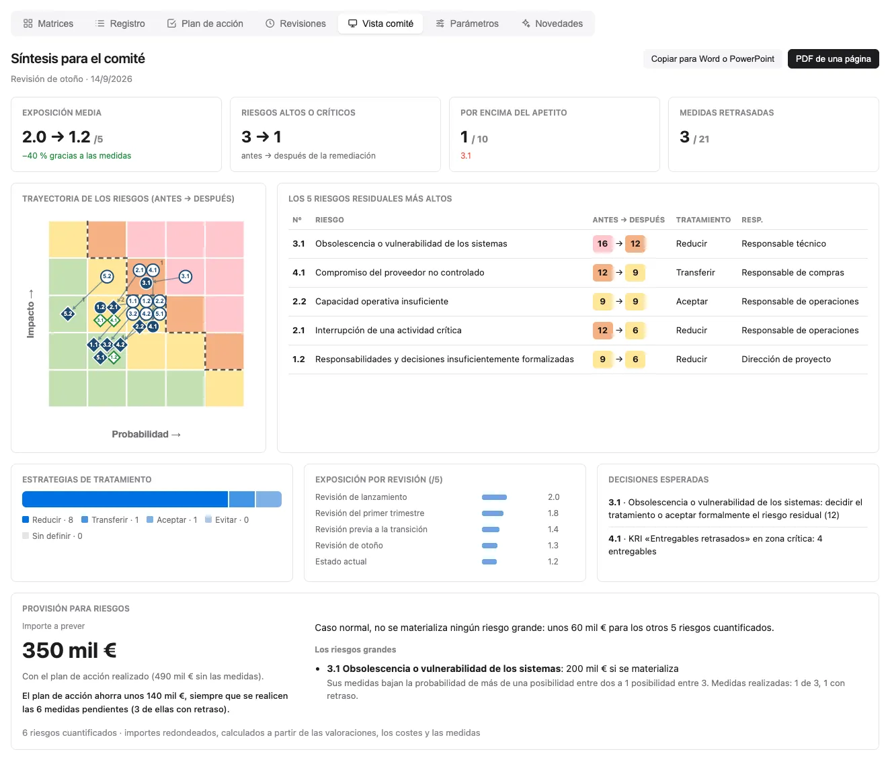
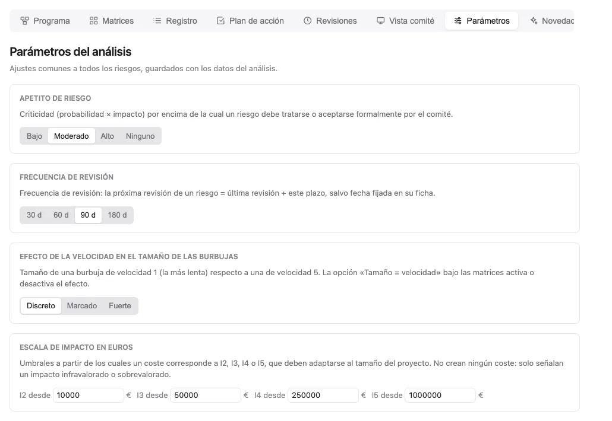

  
  <h1>Riskr</h1>
  
Aplicación web de análisis y cartografía de riesgos, con matrices antes/después y gestión colaborativa.

  <a href="README.md">🇬🇧 English</a> ·
  <a href="README.fr.md">🇫🇷 Français</a> ·
  <a href="README.es.md">🇪🇸 Español</a> ·
  <a href="README.zh.md">🇨🇳 中文</a> ·
  <a href="README.ar.md">🇸🇦 العربية</a>

## 📋 Acerca de

**Riskr** es una aplicación web de una sola página, completa, para el análisis y la gestión de riesgos. Muestra cómo evolucionan los riesgos antes y después de aplicar medidas de remediación, mediante matrices interactivas y tablas detalladas.

## 🖼️ Capturas de pantalla

Capturas realizadas con los datos de demostración de `riskr-data.js`, totalmente
ficticios (un proyecto imaginario de modernización de un sistema de información),
mostrados en tema claro. Cada versión de este README
tiene sus propias capturas en su idioma (interfaz y datos de demostración traducidos
para la ocasión, `docs/captures/traductions/`). Para regenerarlas tras un cambio de
interfaz: `node docs/captures/generer-captures.mjs` (requiere Chrome).

**Matrices**: trayectoria antes → después, objetivo (insignia de rombo azul = objetivo
alcanzado, rombo blanco = objetivo buscado), apetito de riesgo, estado a la fecha de una revisión.

<picture>
  
</picture>

<picture>
  
</picture>

**Registro**: calificaciones antes → después · objetivo, tendencia entre revisiones, tratamiento,
responsable, próxima fecha límite y medidas.

<picture>
  
</picture>

**Ficha del riesgo**: frecuencia de revisión, bow-tie (causas, barreras y su
eficacia, consecuencias), indicadores clave de riesgo (KRI) con umbrales y lecturas,
costeo en euros, tendencia de la calificación, notas, enlaces e historial de cambios.

<picture>
  
</picture>

**Plan de acción**: medidas por estado, responsable o fecha límite, elementos retrasados
resaltados; una tarjeta puede arrastrarse a la posición deseada o a otra columna para cambiar
su estado (vista por estado) o su responsable (vista por responsable).

<picture>
  
</picture>

**Revisiones**: cronología de revisiones registradas, frecuencia de revisión, últimos cambios
firmados, comparación libre, cambios de calificación y exposición por grupo.

<picture>
  
</picture>

**Vista comité**: síntesis de una página (decisiones esperadas, KRI críticos, provisión
de riesgo mediante simulación Monte Carlo), copiable en Word o PowerPoint y exportable a PDF.

<picture>
  
</picture>

**Parámetros**: ajustes compartidos por todo el análisis (apetito de riesgo, frecuencia de
revisión, efecto de la velocidad en el tamaño de las burbujas, escala de impacto en euros),
recordados con un enlace «modificar» allí donde se utilizan.

<picture>
  
</picture>

## 📦 Datos separados (riskr-data.js)

Los datos residen en `riskr-data.js` (formato `window.RISKR_DATA`), cargado
automáticamente por `riskr.html`. El HTML es el motor y el archivo de datos es el
contenido: para un nuevo análisis, solo cambia `riskr-data.js`.

- **Formato canónico**: `risks[]` plano + `riskGroups[].riskIds`
- **Ida y vuelta garantizada**: la exportación JSON y la exportación `riskr-data.js`
  (menú Exportar) producen este mismo formato, que puede reimportarse o recargarse
  tal cual junto al HTML
- Sin `riskr-data.js`, la página muestra un marcador de posición mínimo (no hay
  datos de ejemplo ocultos en el HTML)
- Al abrirse localmente, `riskr-data.local.js` puede sustituir los datos genéricos. Lo
  ignora Git y solo debe contener datos privados que no deban publicarse.

Cada riesgo tiene cuatro calificaciones: `assessmentBefore` (inherente), `assessmentCurrent`
(observada), `assessmentAfter` (previsión tras las acciones abiertas) y
`assessmentTarget` (objetivo), como `[probability, impact]`
(1 a 5; `[0, 0]` = no evaluado). La criticidad es probabilidad × impacto (sobre 25);
se muestra escalada a 5 (puntuación ÷ 5) en las tablas y matrices.
En los archivos antiguos con medidas sin terminar, la calificación actual parte por
prudencia de la calificación inherente y queda señalada para revisión.

Los nombres de los campos de datos están en francés (idioma original de la aplicación):

- `mesures`: lista de medidas `{ texte, porteur, echeance, etat, verification }` (texto, responsable,
  fecha límite, estado; responsable y fecha límite son opcionales; `etat` es `todo`, `doing` o
  `done`; también se acepta una cadena de texto simple). Una fecha límite en formato `YYYY-MM-DD`
  o `DD/MM/YYYY` que ya haya pasado en una medida no terminada la marca como retrasada.
- `causes`: textos del bow-tie; `consequences`: `{ texte, chiffrage }` (texto, costeo;
  también se acepta una cadena simple). Cada medida tiene también `barriere`
  (`prevention` o `protection`), su lado del bow-tie, y `efficacite`
  (eficacia, de 0 a 5). `rang` (opcional) conserva la posición elegida por arrastrar y
  soltar en el plan de acción; sin rango, las medidas se ordenan por retraso y luego por fecha límite.
- `velocite`: velocidad entre el evento y su impacto (1 a 5, 0 = no evaluada), utilizada por la
  opción «Tamaño = velocidad» de las matrices. `proximityDate` indica por separado
  cuándo podría producirse el evento; `milestone` nombra el hito relacionado.
- `kind` distingue amenazas y oportunidades; `impactAxes` califica los efectos en
  coste, plazo, calidad, servicio y beneficio. `event`, `objective`, `raisedAt` y
  `raisedBy` registran el evento incierto, el objetivo afectado y el origen.
- `lifecycle` es `active`, `materialized`, `closed` o `transferred`;
  `lifeDate`, `lifeReason`, `transferOwner` e `issue` conservan los datos de salida
  y del problema.
- `decisions` registra decisiones fechadas, quién decide, el motivo, la fecha de
  reexamen y la puntuación aceptada. Una aceptación vencida o agravada exige una nueva decisión.
- `notes`: notas de revisión `{ date, auteur, texte }` (fecha, autor, texto); `liens`:
  documentos y enlaces `{ libelle, url }` (etiqueta, URL).
- `settings.templates`: «Mis modelos» de la biblioteca `{ titre, description,
  cotation, mesures }`.
- `uid`: identificador interno estable de un riesgo (generado automáticamente), utilizado para
  seguir un riesgo de una revisión a otra a pesar de la renumeración.
- `kri`: indicadores clave de riesgo `{ id, nom, unite, sens, alerte, critique,
  releves: [{ date, valeur, auteur }] }` (nombre, unidad, sentido, umbrales de alerta y
  crítico, lecturas); `sens` es `hausse` (cuanto mayor el valor, peor) o
  `baisse`; la última lectura da el estado (verde, naranja en el umbral de alerta,
  rojo en el umbral crítico).
- `cout`: costeo `{ min, probable, max, probabilite, sansProtection }` — coste en
  euros si el riesgo ocurre (basta con un único valor) y probabilidad en %; cuando está
  vacío, la probabilidad procede de la calificación P tras la remediación (P1 a P5: 5,
  15, 35, 60, 85%). `sansProtection` (opcional): coste probable si el riesgo ocurriera
  sin las medidas de protección.
- `revuLe` / `prochaineRevue` (opcional, `YYYY-MM-DD`): última revisión declarada y
  próxima revisión elegida; `settings.cadenceRevue`: revisar los riesgos cada N días (90 por defecto).
- `journal`: historial de cambios `{ id, date, auteur, uid, risque, champ, detail, avant,
  apres }`, completado automáticamente en cada cambio (2.000 líneas como máximo). El
  menú Exportar ofrece «riskr-data.js · Sin historial» para compartir el análisis sin
  esos nombres y horas.
- `reviews`: revisiones registradas `{ id, date, label, auteur, note, risks: [{ uid, id,
  title, before, after, motif }] }`, instantáneas fechadas de las calificaciones utilizadas para comparaciones; `note` resume la revisión y `motif` explica una calificación.
- `statut` es `statusNotTreated`, `statusInProgress`, `statusTreated` o
  `statusAccepted`.
- `traitement` (estrategia) es `reduce`, `accept`, `transfer`, `avoid`, `escalate`
  para las amenazas, o `exploit`, `enhance`, `share`, `accept`, `escalate` para las
  oportunidades, o `''`
  (no definido); `assessmentTarget` es la calificación objetivo `[probability, impact]`
  (`[0, 0]` = no definida).
- `settings.riskAppetite`: puntuación máxima aceptable (P × I, sobre 25; `0` = ninguna).
  9 por defecto, justo por debajo del umbral «alto». Se dibuja como una línea de puntos en las
  matrices; un riesgo residual por encima de ella se señala en el registro.
- Los números (`1.1`, `1.2`…) siguen la posición de los riesgos y se
  recalculan tras cada adición, eliminación o desplazamiento.
- Umbrales de criticidad por defecto: bajo 1-4, moderado 5-9, alto 10-14,
  crítico 15-25. Se aplican en todas partes (matrices, insignias, tablas) y pueden
  cambiarse en `appState.criticalityThresholds`, por ejemplo
  `{ medium: 5, high: 10, critical: 15 }`.
- El promedio de un grupo es la criticidad media de sus riesgos evaluados, sobre 5
  como en la tabla resumen.
- La importación también acepta formatos anteriores: riesgos anidados en grupos, calificaciones
  dobles antiguas (`assessmentA*`/`assessmentB*`, `gcBefore`/`dtuBefore`…), estados como texto
  («En cours»…). Un archivo no válido se rechaza sin modificar el análisis mostrado.

Cada grupo puede tener también dos campos resumen para los responsables de decisión:

- `assessmentNote`: lectura breve de la categoría;
- `remediationNote`: remediación prevista.

Riskr limita estos dos textos a 30 palabras. El motor sigue siendo compatible con archivos de
datos antiguos que no los contienen.

### Gestión de riesgos del programa

La pestaña **Programa** organiza un análisis en torno a un objetivo estratégico.
Los archivos antiguos sin `program` siguen siendo registros de proyecto. Un programa
contiene sus **proyectos** (`components`, de tipo `project`, o `work` para un trabajo
transversal que no es un proyecto, como la coordinación de proveedores), `benefits`,
`dependencies`, `scenarios`, `escalations`, `stages` y `decisions`. Los grupos de
riesgos siguen siendo **categorías temáticas**.

Una barra encima de las pestañas muestra el programa seguido de sus proyectos. Al hacer
clic en un proyecto, las matrices, el registro, el plan de acción, las revisiones y la
vista comité se limitan a los riesgos que ese proyecto gestiona o que le afectan; al
hacer clic en el programa se recupera la vista global. El navegador recuerda esta
elección de visualización, que no se guarda en el análisis.

Cada riesgo conserva un único `uid` estable y una única ficha. `scopeLevel` y
`componentId` identifican su registro propietario; `affectedComponentIds` enumera los
demás proyectos afectados. Un riesgo compartido aparece en varias vistas, pero solo se
muestrea una vez en la provisión global. `programOrigin` y `programOriginNote`
indican si se identificó aquí, si se derivó de la organización o si se escaló desde un
proyecto. Los vínculos usan identificadores estables, nunca los números mostrados.

Los beneficios tienen un valor de referencia, un objetivo, un valor real, un responsable,
una fecha límite y riesgos vinculados. Un valor real vacío significa **por medir**, no
cero. La tolerancia delegada señala los riesgos para revisión; la escalada y las
decisiones siguen siendo acciones humanas fechadas. Las reservas de los proyectos y del
programa se muestran por separado.
Una decisión de seguimiento registra la puntuación observada; aparece otra alerta si el
riesgo empeora o pasa a otro registro propietario.
Una escalada aceptada por la organización sigue vinculada a su ficha en Riskr hasta su
transferencia explícita; este producto no incluye un registro de riesgos corporativo.
Las revisiones de riesgos ya existentes en Riskr también cubren los riesgos del programa;
las fechas y notas de las revisiones recientes se ven desde la pestaña Programa.

Las dependencias conectan dos proyectos. Los escenarios combinados añaden un **coste
incremental** y una probabilidad introducidos explícitamente; deben vincularse al menos
dos amenazas activas para que un escenario se cuantifique. La simulación P80 no modela
la correlación entre eventos. Los valores P80 de los proyectos no deben sumarse. Las
estimaciones del programa usan 1.000 tiradas globales y 250 tiradas por proyecto para
que la pestaña siga siendo fluida. Antes del cierre, los riesgos activos u ocurridos
deben transferirse con un responsable, una fecha y un motivo; las transferencias pueden
exportarse en CSV. El formato canónico de datos conserva todos los datos del programa.

## 🔌 100% sin conexión

Todas las bibliotecas (chart.js 4.4.0, jsPDF 2.5.1, jspdf-autotable 3.8.2,
xlsx 0.18.5) están incluidas en línea en el HTML: sin dependencia de CDN, la página funciona
totalmente sin red (un único archivo de unos 2 MB).

## ✨ Funcionalidades

### Diseño por pestañas
- **Matrices** (matrices, panel lateral, promedios por grupo, tabla resumen),
  **Registro** (tabla compacta, tarjetas o edición completa), **Plan de acción**,
  **Revisiones**, **Vista comité**, **Parámetros**, **Novedades** (historial de cambios
  desde la primera versión, con enlaces a los commits); la pestaña seleccionada se
  recuerda y aparece en la dirección (`riskr.html#revues`, `riskr.html#fiche:…`);
  los botones Atrás / Adelante del navegador permiten pasar de una pestaña o ficha de riesgo a otra
  sin salir de la página. Al hacer clic en una celda de la matriz se filtra el registro y el
  panel lateral.
- **Ficha del riesgo** (clic en un riesgo, dirección `riskr.html#fiche:<uid>`):
  calificaciones antes → después → objetivo, tratamiento, responsable, velocidad, bow-tie
  vinculado (eficacia de las barreras, costeo de las consecuencias), tendencia de la calificación,
  notas de revisión, documentos y enlaces, «Guardar como modelo».
- La versión antigua de una sola página sigue disponible mediante la etiqueta Git
  `v-une-page`.

### Gestión de riesgos
- **Edición en línea** de todos los campos (títulos, descripciones, categorías)
- **Añadir/eliminar** riesgos y grupos de riesgos
- **Arrastrar y soltar** para reordenar los riesgos
- **Numeración automática** según la posición (adición, eliminación, arrastrar y soltar)
- **Medidas de remediación** con responsable, fecha límite opcional y estado
  (por hacer, en curso, hecha); fechas retrasadas mostradas en rojo
- **Plan de acción**: progreso, medidas agrupadas por estado, responsable o fecha límite,
  «Mis medidas», etiqueta prevención / protección, retrasadas primero, arrastrar y soltar de
  tarjetas: se conserva el orden dentro de la columna, cambio de estado (vista por estado) o
  responsable (vista por responsable)
- **Identidad declarada**: insignia arriba a la derecha (iniciales, color estable por
  nombre, «—» si es anónimo). El nombre es opcional; mientras es anónimo, se solicita
  en el primer cambio de cada sesión (nunca al solo consultar); se guarda en el
  navegador, firma el historial de cambios y precompleta el autor de las notas y las
  revisiones. Sin verificación: es declarativo.
- **Historial de cambios**: quién cambió qué y cuándo (calificaciones, tratamiento, responsable,
  medidas, notas…), en la ficha del riesgo y, para todo el análisis, en la pestaña Revisiones
  («Últimos cambios»); Deshacer también elimina la línea correspondiente
- **Indicadores clave de riesgo (KRI)**: en la ficha del riesgo, mediciones cuantificadas por
  riesgo con umbrales de alerta y crítico, lecturas fechadas y firmadas, minigráfico;
  contador «KRI en alerta» en el registro, KRI críticos en las decisiones esperadas
  de la vista comité
- **Costeo y provisión de riesgo**: rango de coste por amenaza activa en la ficha,
  y en la vista comité (y el PDF) la **provisión P80 actual** y su previsión tras
  las acciones. Las oportunidades y los riesgos cerrados se excluyen; las amenazas
  activas sin coste se cuentan aparte. El
  texto se genera automáticamente a partir de las calificaciones, costes y medidas, sin
  jerga estadística: caso normal (no ocurre ningún gran riesgo), luego para cada gran riesgo su
  coste si ocurre, el efecto de sus medidas (probabilidad «1 posibilidad entre 3 →
  1 posibilidad entre 7» para la prevención, coste reducido para la protección) y su progreso.
  Calculado a partir de 10.000 simulaciones Monte Carlo (distribución triangular, resultados estables).
  El modelo supone riesgos independientes; no cuantifica correlaciones ni escenarios combinados.
- **Detector de incoherencias**: alertas «por verificar» (nada se bloquea) cuando una
  probabilidad introducida queda fuera de la banda de la calificación P, cuando un coste no
  coincide con la calificación de impacto según la escala en euros del análisis
  (`settings.echelleImpact`, definida en la pestaña Parámetros), cuando un KRI está crítico en un
  riesgo calificado como improbable, o cuando las calificaciones se contradicen entre sí; contador y
  filtro en el registro, detalles en la ficha
- **Frecuencia de revisión**: cada riesgo tiene una próxima revisión (fecha elegida, si no
  última revisión + una frecuencia de 30, 60, 90 o 180 días definida en la pestaña Parámetros, y
  recordada en la pestaña Revisiones y en la ficha); «Marcar como revisado» en la ficha;
  los riesgos pendientes de revisión se señalan y pueden filtrarse en el registro; recordatorios
  exportados como `.ics` (Outlook, Google Calendar, Calendar)
- **Fusión de dos archivos** (menú Importar › «Fusionar un archivo…», JSON o
  `riskr-data.js`): multiusuario ligero. Los riesgos se emparejan por identificador estable; un
  riesgo modificado en ambos lados conserva la versión cuyo último cambio (historial de cambios)
  es el más reciente, en caso contrario la versión local (conflicto señalado); notas, enlaces,
  lecturas, revisiones e historial de cambios combinados sin duplicados. Resumen para
  confirmar antes de aplicar, puede deshacerse (Cmd+Z)
- **Responsable editable en todas partes**: al hacer clic en la insignia de responsable (registro,
  plan de acción, ficha) se abre el mismo selector con sugerencias e insignias, que también permite
  crear un nuevo responsable
- **Revisiones**: instantánea fechada de las calificaciones («Registrar una revisión»,
  autor o comité), cronología, comparación de dos revisiones o de una revisión con el estado
  actual (contadores, cambios ordenados por diferencia), curva de exposición media por grupo
  y tendencia por riesgo
- **Estrategia de tratamiento** (reducir, aceptar, transferir, evitar) y **calificación objetivo**
  por riesgo
- **Filtros**: búsqueda, grupo, nivel residual, tratamiento, responsable, riesgos por encima del apetito
- **Categorización** en grupos temáticos
- **Bow-tie** por riesgo: causas, barreras preventivas, evento temido, barreras
  de protección, consecuencias (las barreras son las medidas del riesgo)
- **Biblioteca integrada de riesgos tipo** (sin conexión, 6 temas, 5 idiomas,
  descripción y calificación típica) y «Mis modelos»: añadidos en unos pocos clics, con
  o sin las medidas sugeridas
- **Vista comité** (pestaña): síntesis de una página (indicadores, trayectoria, 5 riesgos
  residuales más altos, tratamientos, exposición por revisión, decisiones esperadas), copiable
  en Word o PowerPoint y exportable a un PDF de una página

### Visualización
- **Matrices Antes/Después** con Chart.js
- **Matrices Antes, Después, lado a lado o Trayectoria**: en la vista de trayectoria,
  cada riesgo pasa de su posición antes (burbuja hueca) a su posición después
  (burbuja rellena)
- **Matrices a la fecha de una revisión**: una cronología bajo el encabezado muestra el estado
  actual («1 cambio desde la revisión n.º 5») o cualquier revisión pasada, de solo lectura; las
  matrices, el panel y las tablas siguen. La vista comité y la exportación a PDF permanecen en el
  estado actual.
- **Visualización**: una línea bajo las matrices donde cada opción lleva su símbolo de
  leyenda (recuento por celda, apetito con su nivel definido en la pestaña Parámetros, objetivo
  como rombo verde, tamaño de burbuja por velocidad, con un efecto discreto, marcado o
  fuerte definido en Parámetros; explicación al pasar el cursor)
- **Panel lateral**: riesgos en la celda seleccionada y los que están por encima del apetito
- **Objetivo**: insignia de rombo azul = objetivo alcanzado; rombo blanco con contorno
  verde, en su calificación = objetivo buscado, aún no alcanzado
- **Apetito de riesgo** dibujado como una línea de puntos, **número de riesgos por celda**
  (opciones de visualización), clic en una celda para filtrar el registro
- Vista comparativa del impacto de la remediación
- Promedios por grupo de riesgos
- Lectura resumida y remediación por grupo
- Leyenda interactiva con códigos de color
- Copia de la tabla resumen a Word, con los colores de calificación
- Copia de una matriz como imagen (título, matriz y leyenda) para pegar en otro sitio

### Historial
- **Deshacer/Rehacer** hasta 50 pasos (Cmd+Z / Cmd+Y en Mac, Ctrl+Z / Ctrl+Y en Windows/Linux)
- Cada cambio (calificación, texto, estado, adición, eliminación, desplazamiento, importación) se registra

### Persistencia de datos
- **Guardar en el archivo**: en Chrome/Edge, haga clic una vez en «Guardar en el archivo», luego
  cada cambio se escribe automáticamente en `riskr-data.js` (o `riskr-data.local.js` si
  el análisis procede del archivo privado). En Firefox/Safari, el botón «Guardar»
  descarga el archivo para sustituirlo junto a `riskr.html`. Un indicador muestra el
  estado, y al cerrar la página se pide confirmación si hay cambios sin guardar.
- **localStorage**: todo el análisis también se guarda en el navegador con cada
  cambio y se restaura al recargar
- Si `riskr-data.js` cambia entre dos aperturas, **el archivo toma el control** y
  los cambios hechos en el navegador se descartan (un mensaje lo indica): exporte
  antes de sustituir el archivo
- **Exportación/importación JSON** para compartir y hacer copias de seguridad
- No requiere conexión a ningún servidor

### Interfaz
- **Diseño responsivo** para móvil, tableta y escritorio
- **Secciones plegables** para facilitar la navegación
- **Edición en línea** fluida con retroalimentación visual
- **Temas claro y oscuro**: sigue la preferencia del sistema, se cambia con el icono de
  sol/luna (preferencia guardada en el navegador). Las copias de imagen y el PDF permanecen en la
  versión clara
- **Comandos con iconos** (importar, exportar, guardar, idioma, tema), etiquetas en información sobre herramientas
- **5 idiomas**: francés, inglés, español, árabe (de derecha a izquierda) y chino.
  El PDF usa inglés para el árabe y el chino (fuentes latinas de jsPDF)

## 🚀 Uso

**Riskr es una aplicación de una sola página**: un único archivo HTML autónomo.

1. Descargue `riskr.html`
2. Abra el archivo en su navegador
3. ¡Eso es todo! No requiere instalación

## 🛠️ Stack técnico

### Frontend
- **HTML5** - Estructura semántica
- **CSS3** - Estilos modernos con flexbox/grid
- **JavaScript (ES6+)** - Vanilla JS, sin dependencia de framework

### Bibliotecas
- **Chart.js** - Visualización de la matriz de riesgos
- Ninguna otra dependencia externa

### Persistencia
- **localStorage** - Almacenamiento nativo del navegador, aislado por análisis
- Formato JSON para importar/exportar

### Arquitectura
- **Aplicación de una sola página** - Todo en un único archivo HTML
- No requiere compilación ni empaquetador
- Funciona sin conexión una vez cargada

## 📄 Licencia

Este proyecto está licenciado bajo la **GNU Affero General Public License v3.0 (AGPL-3.0)**.

### Resumen de la licencia
- ✅ Libre de usar, modificar y distribuir
- ✅ Código fuente disponible y modificable
- ⚠️ **Importante para SaaS**: si ejecuta Riskr en un servidor accesible por red (SaaS), debe compartir el código fuente modificado con sus usuarios

Consulte el archivo [LICENSE](LICENSE) para más detalles.

## 🤝 Contribuir

¡Las contribuciones son bienvenidas!

1. Haga un fork del proyecto
2. Cree una rama para su funcionalidad (`git checkout -b feature/AmazingFeature`)
3. Confirme sus cambios (`git commit -m 'Add some AmazingFeature'`)
4. Envíe la rama (`git push origin feature/AmazingFeature`)
5. Abra una Pull Request

## 📞 Soporte

Para cualquier pregunta o sugerencia:
- Abra un [issue](https://github.com/guthubrx/Riskr/issues)
- Consulte la documentación en el código fuente

---

© 2025 Riskr — Aplicación de análisis y cartografía de riesgos
