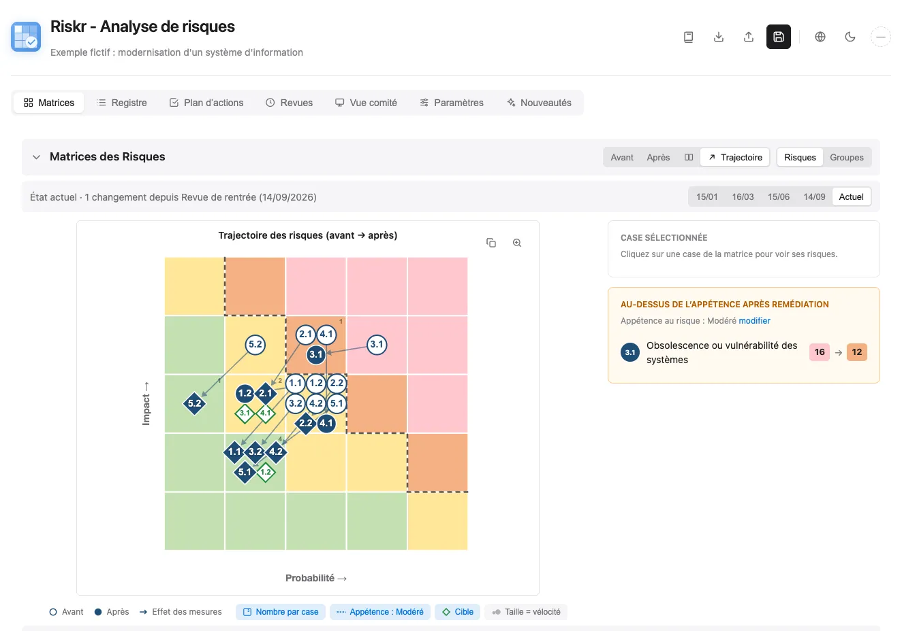
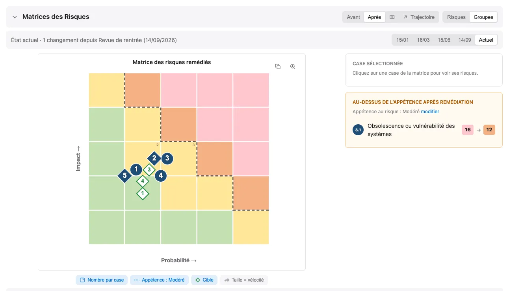
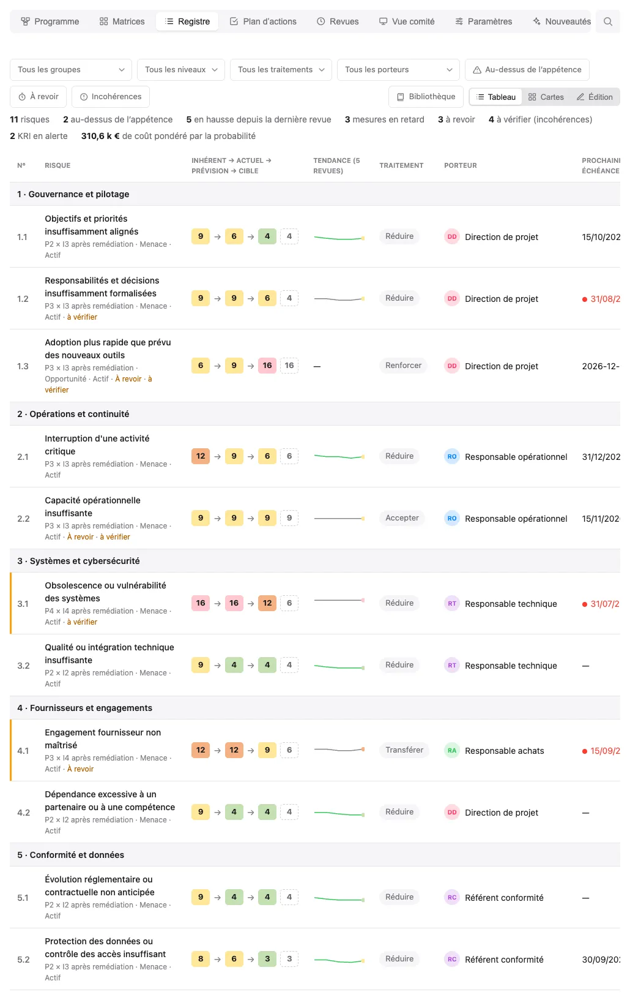
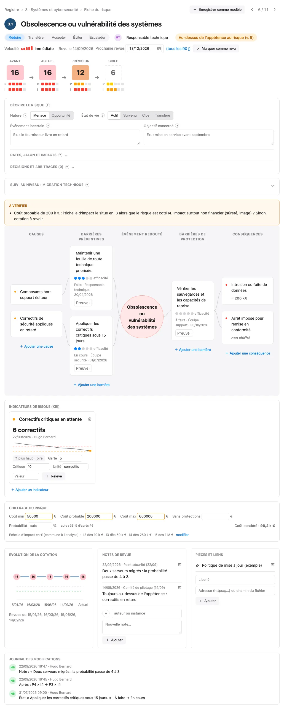
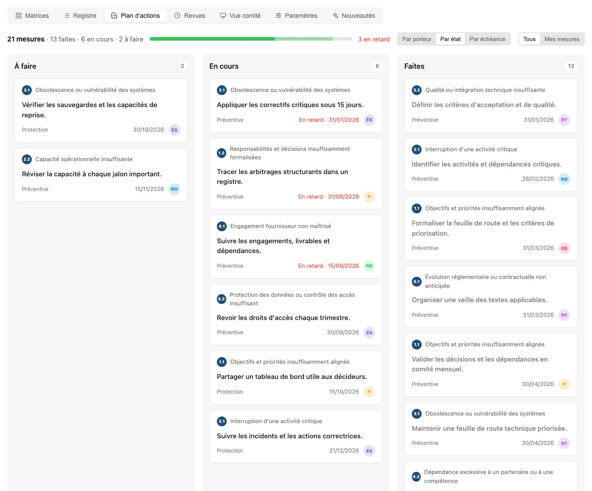
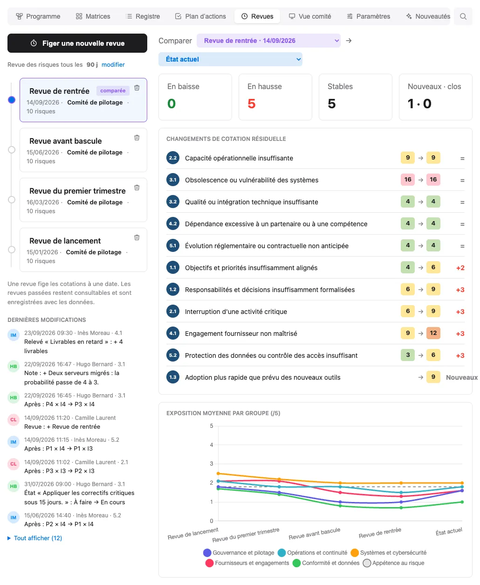
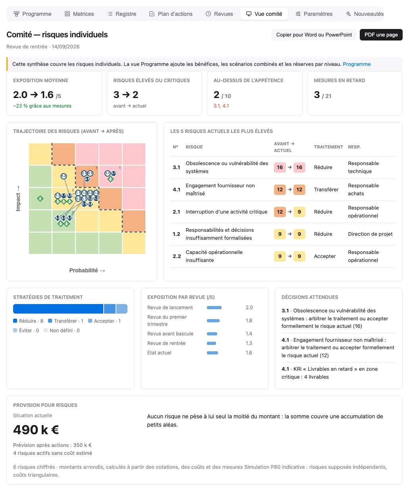
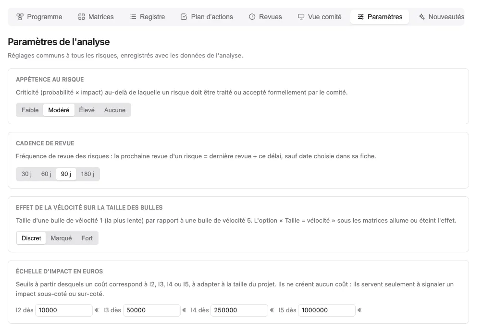

  
  <h1>Riskr</h1>
  
Application web d'analyse et de cartographie des risques avec matrices Before/After et gestion collaborative.

  <a href="README.md">🇬🇧 English</a> ·
  <a href="README.fr.md">🇫🇷 Français</a> ·
  <a href="README.es.md">🇪🇸 Español</a> ·
  <a href="README.zh.md">🇨🇳 中文</a> ·
  <a href="README.ar.md">🇸🇦 العربية</a>

## 📋 À propos

**Riskr** est une application web one-page complète pour l'analyse et la gestion des risques. Elle permet de visualiser l'évolution des risques avant et après la mise en place de mesures de remédiation, à travers des matrices interactives et des tableaux détaillés.

## 🖼️ Captures d'écran

Captures réalisées avec les données de démonstration de `riskr-data.js`,
entièrement fictives (projet imaginaire de modernisation d'un système d'information),
affichées en thème clair ou sombre selon celui de GitHub. Chaque version de ce
README a ses captures dans sa langue (interface et données de démonstration
traduites pour l'occasion, `docs/captures/traductions/`). Pour les régénérer après
une évolution de l'interface : `node docs/captures/generer-captures.mjs` (Chrome requis).

**Matrices** : trajectoire avant → après, cible (pastille en losange bleu = cible
atteinte, losange blanc = cible visée), appétence, état à la date d'une revue.

<picture>
  <source media="(prefers-color-scheme: dark)" srcset="docs/captures/fr/dark/matrices.webp">
  
</picture>

<picture>
  <source media="(prefers-color-scheme: dark)" srcset="docs/captures/fr/dark/matrices-groupes.webp">
  
</picture>

**Registre** : cotations avant → après · cible, tendance sur les revues, traitement,
porteur, prochaine échéance et mesures.

<picture>
  <source media="(prefers-color-scheme: dark)" srcset="docs/captures/fr/dark/registre.webp">
  
</picture>

**Fiche du risque** : cadence de revue, nœud papillon (causes, barrières et leur
efficacité, conséquences), indicateurs clés de risque (KRI) avec seuils et relevés,
chiffrage en euros, évolution de la cotation, notes, liens et journal des modifications.

<picture>
  <source media="(prefers-color-scheme: dark)" srcset="docs/captures/fr/dark/fiche.webp">
  
</picture>

**Plan d'actions** : mesures par état, porteur ou échéance, retards en évidence ;
une carte se glisse à la hauteur voulue ou dans une autre colonne pour changer
son état (vue par état) ou son porteur (vue par porteur).

<picture>
  <source media="(prefers-color-scheme: dark)" srcset="docs/captures/fr/dark/plan-actions.webp">
  
</picture>

**Revues** : frise des revues figées, cadence de revue, dernières modifications
signées, comparaison au choix, changements de cotation et exposition par groupe.

<picture>
  <source media="(prefers-color-scheme: dark)" srcset="docs/captures/fr/dark/revues.webp">
  
</picture>

**Vue comité** : synthèse d'une page (décisions attendues, KRI critiques, provision
pour risques par simulation Monte-Carlo), copiable dans Word ou PowerPoint et exportable en PDF.

<picture>
  <source media="(prefers-color-scheme: dark)" srcset="docs/captures/fr/dark/comite.webp">
  
</picture>

**Paramètres** : réglages communs à toute l'analyse (appétence au risque, cadence de
revue, effet de la vélocité sur la taille des bulles, échelle d'impact en euros),
rappelés avec un lien « modifier » là où ils servent.

<picture>
  <source media="(prefers-color-scheme: dark)" srcset="docs/captures/fr/dark/parametres.webp">
  
</picture>

## 📦 Données séparées (riskr-data.js)

Les données vivent dans `riskr-data.js` (format `window.RISKR_DATA`), chargé
automatiquement par `riskr.html`. Le HTML est le moteur, le fichier de données
est le contenu : pour une nouvelle analyse, seul `riskr-data.js` change.

- **Format canonique** : `risks[]` à plat + `riskGroups[].riskIds`
- **Round-trip garanti** : l'export JSON et l'export `riskr-data.js`
  (menu Exporter) produisent ce même format, ré-importable et rechargeable
  tel quel à côté du HTML
- Sans `riskr-data.js`, la page affiche un placeholder minimal (pas de
  données d'exemple cachées dans le HTML)
- En ouverture locale, `riskr-data.local.js` peut surcharger les données
  génériques. Il est ignoré par Git et ne doit contenir que des données privées
  qui ne doivent pas être publiées.

Chaque risque porte quatre cotations : `assessmentBefore` (sans mesures),
`assessmentCurrent` (situation constatée), `assessmentAfter` (prévision après
les actions ouvertes) et `assessmentTarget` (cible), sous la forme `[probabilité, impact]`
(1 à 5 ; `[0, 0]` = non évalué). La criticité vaut probabilité × impact (sur 25) ;
elle est affichée ramenée sur 5 (score ÷ 5) dans les tableaux et les matrices.
Pour un ancien fichier ayant encore des mesures ouvertes, la cotation actuelle
reprend par prudence la cotation sans mesures et reste signalée « à confirmer ».

- `mesures` : liste de mesures `{ texte, porteur, echeance, etat, verification }` (porteur et
  échéance facultatifs ; `etat` vaut `todo`, `doing` ou `done` ; une simple chaîne
  de texte est aussi acceptée). Une échéance au format `AAAA-MM-JJ` ou
  `JJ/MM/AAAA` passée sur une mesure non faite la signale en retard.
- `causes` : textes du nœud papillon ; `consequences` : `{ texte, chiffrage }`
  (une simple chaîne est aussi acceptée). Chaque mesure porte aussi `barriere`
  (`prevention` ou `protection`), son côté dans le nœud, et `efficacite` (0 à 5).
  `rang` (facultatif) garde la position choisie par glisser-déposer dans le plan
  d'actions ; sans rang, les mesures sont triées par retard puis par échéance.
- `velocite` : vitesse entre le déclenchement du risque et son effet (1 à 5,
  0 = non évaluée), utilisée par l'option « Taille = vélocité » des matrices.
  `proximityDate` indique séparément quand l'événement pourrait survenir ;
  `milestone` désigne le jalon concerné.
- `kind` distingue une menace d'une opportunité ; `impactAxes` cote les effets
  sur coût, délai, qualité, service et bénéfice. `event`, `objective`,
  `raisedAt` et `raisedBy` décrivent l'événement incertain, l'objectif touché
  et la déclaration.
- `lifecycle` vaut `active`, `materialized`, `closed` ou `transferred` ;
  `lifeDate`, `lifeReason`, `transferOwner` et `issue` gardent le suivi de sortie
  et du problème lorsque le risque s'est produit.
- `decisions` conserve les arbitrages datés avec décideur, motif, date de
  réexamen et score accepté. Une acceptation expirée ou aggravée revient en
  liste des décisions attendues.
- `notes` : notes de revue `{ date, auteur, texte }` ; `liens` : pièces et liens
  `{ libelle, url }`.
- `settings.templates` : « Mes modèles » de la bibliothèque `{ titre, description,
  cotation, mesures }`.
- `uid` : identifiant interne stable d'un risque (généré automatiquement), qui
  permet de suivre un risque d'une revue à l'autre malgré la renumérotation.
- `kri` : indicateurs clés de risque `{ id, nom, unite, sens, alerte, critique,
  releves: [{ date, valeur, auteur }] }` ; `sens` vaut `hausse` (plus la valeur
  monte, plus c'est grave) ou `baisse` ; le dernier relevé donne le statut
  (vert, orange au seuil d'alerte, rouge au seuil critique).
- `cout` : chiffrage `{ min, probable, max, probabilite, sansProtection }` — coût
  en euros si le risque survient (une seule valeur suffit) et probabilité en % ;
  vide, la probabilité découle de la cotation P après remédiation (P1 à P5 : 5, 15,
  35, 60, 85 %). `sansProtection` (facultatif) : coût probable si le risque se
  réalisait sans les mesures de protection.
- `revuLe` / `prochaineRevue` (facultatifs, `AAAA-MM-JJ`) : dernière revue
  déclarée et prochaine revue choisie ; `settings.cadenceRevue` : revue des risques
  tous les N jours (90 par défaut).
- `journal` : journal des modifications `{ id, date, auteur, uid, risque, champ,
  detail, avant, apres }`, alimenté automatiquement à chaque modification
  (2 000 lignes au plus). Le menu Exporter propose « riskr-data.js · Sans journal »
  pour partager l'analyse sans ces noms et horaires.
- `reviews` : revues figées `{ id, date, label, auteur, note, risks: [{ uid, id,
  title, before, after, motif }] }`, photos datées des cotations servant aux
  comparaisons ; `note` résume la revue et `motif` explique une cotation.
- `statut` vaut `statusNotTreated`, `statusInProgress`, `statusTreated` ou
  `statusAccepted`.
- `traitement` (stratégie) vaut `reduce`, `accept`, `transfer`, `avoid`,
  `escalate` pour les menaces, ou `exploit`, `enhance`, `share`, `accept`,
  `escalate` pour les opportunités, ou `''`
  (non définie) ; `assessmentTarget` est la cotation visée `[probabilité, impact]`
  (`[0, 0]` = non définie).
- `settings.riskAppetite` : score maximal acceptable (P × I, sur 25 ; `0` = aucun).
  Par défaut 9, juste sous le seuil « élevé ». Tracé en pointillé sur les matrices ;
  un risque résiduel au-delà est signalé dans le registre.
- Les numéros (`1.1`, `1.2`…) suivent la position des risques et sont
  recalculés après chaque ajout, suppression ou déplacement.
- Seuils de criticité par défaut : faible 1-4, modéré 5-9, élevé 10-14,
  critique 15-25. Ils s'appliquent partout (matrices, badges,
  tableaux) et se modifient dans `appState.criticalityThresholds`,
  par exemple `{ medium: 5, high: 10, critical: 15 }`.
- La moyenne d'un groupe est la moyenne des criticités de ses risques évalués,
  sur 5 comme dans le tableau récapitulatif.
- L'import accepte aussi les anciens formats : risques imbriqués dans les
  groupes, anciennes doubles cotations (`assessmentA*`/`assessmentB*`,
  `gcBefore`/`dtuBefore`…), statuts en texte (« En cours »…). Un fichier
  invalide est refusé sans modifier l'analyse affichée.

Chaque groupe peut également comporter deux champs de synthèse destinés aux
décideurs :

- `assessmentNote` : lecture courte de la catégorie ;
- `remediationNote` : remédiation visée.

Riskr contrôle ces deux textes à 30 mots maximum. Le moteur reste compatible
avec les anciens fichiers de données qui ne les contiennent pas.

### Gestion des risques programme

L'onglet **Programme** organise une analyse autour d'un objectif stratégique.
`program` est absent dans un ancien fichier : Riskr reste alors utilisable comme
registre projet. Un programme contient ses **projets** (`components`, de type
`project`, ou `work` pour un chantier transverse qui n'est pas un projet, comme
la coordination des fournisseurs), des `benefits`, `dependencies`, `scenarios`,
`escalations`, `stages` et `decisions`. Les groupes de risques restent des
**catégories thématiques**.

Le nom du programme devient le titre de la page (un clic dessus ramène en haut) ; dessous, un fil d'Ariane affiche le chemin programme › projet ;
chaque niveau du chemin se clique pour remonter. La liste déroulante
« Projets (n) » au bout du chemin descend vers un projet ; sa première option
ramène au programme. Choisir un projet limite les matrices, le registre, le plan
d'actions, les revues et la vue comité aux risques que ce projet porte ou qui le
touchent. Le premier onglet suit le niveau et change de nom : **Programme** (page
du programme avec la liste de ses projets) ou **Projet** (chiffres du projet et
risques qu'il porte ou qui le touchent) ; le bouton « Ouvrir » d'une ligne de
projet descend à son niveau. Ce choix d'affichage est mémorisé dans le
navigateur et n'est pas enregistré dans l'analyse.

Chaque risque garde un seul `uid` et une seule fiche. `scopeLevel` et
`componentId` désignent son registre propriétaire ; `affectedComponentIds`
indique les autres projets touchés. Il peut donc apparaître dans plusieurs
vues sans être compté plusieurs fois dans la provision globale. `programOrigin`
et `programOriginNote` indiquent s'il a été identifié dans ce registre, décliné
de l'organisation ou remonté d'un projet. Les liens utilisent toujours les
identifiants stables, jamais les numéros affichés qui changent avec l'ordre.

Un bénéfice a une référence, une cible, une valeur constatée, un responsable,
une échéance et des risques liés. Une valeur constatée vide signifie **à mesurer**.
Les tolérances déléguées signalent les risques au-dessus du niveau autorisé ;
l'escalade et les décisions restent des actes humains datés. Les réserves des
projets et du programme sont affichées séparément.
Une décision de suivi mémorise le score observé : une nouvelle alerte apparaît
si ce risque s'aggrave ou change de registre propriétaire.
Une escalade acceptée par l'organisation garde sa fiche dans Riskr jusqu'au
transfert explicite : ce produit ne contient pas de registre d'entreprise.
Les revues de risques déjà présentes dans Riskr couvrent aussi les risques du
programme ; leurs dernières dates et notes sont visibles depuis cet onglet.

Les dépendances relient deux projets. Les scénarios combinés ajoutent un
**surcoût incrémental** et une probabilité explicitement saisis ; au moins deux
menaces actives doivent être liées pour qu'un scénario soit chiffré. Cette
simulation P80 ne modélise pas la corrélation entre événements. Les P80 par
projet ne s'additionnent pas. Les estimations utilisent 1 000 tirages au
niveau global et 250 par projet pour garder l'onglet réactif. Avant
clôture, les risques actifs ou survenus
doivent être transférés avec responsable, date et motif ; les transferts
s'exportent en CSV. Le format canonique conserve toutes les données programme.

Sur un écran large, une arborescence à gauche montre le programme (ou le portefeuille), ses programmes et leurs projets, avec le nombre de risques actifs et un point orange s'il y en a au-delà de la tolérance. Un clic choisit le niveau ; chaque programme ou projet retrouve l'onglet et les filtres qu'on y avait laissés (un niveau jamais ouvert garde la vue en cours) ; une fiche ouverte hors du nouveau niveau se referme. Le panneau occupe toute la hauteur de la page ; il se replie et sa largeur se règle en tirant son bord (double-clic : largeur d'origine), choix mémorisés par le navigateur.

### Gestion de portefeuille

Un portefeuille réunit plusieurs programmes, chacun tenu dans son propre
fichier. Il contient `portfolio` (`uid`, `title`, `objective`, `owner`,
`staleAfterDays`, `programs`, `decisions`, `journal`) et aucun risque propre
(`risks` et `riskGroups` vides) : le même `riskr.html` passe alors en mode
portefeuille. Un fichier sans `portfolio` fonctionne comme avant. On le crée
depuis l'onglet Programme d'une analyse sans programme (**Créer un portefeuille**).

**Importer un programme** lit le `riskr-data.js` ou l'export JSON d'un
programme et en garde une copie figée dans `programs` (`uid` du programme,
`code`, `importedAt`, `source`, `data`). Réimporter le même programme remplace
sa copie après confirmation ; un fichier sans programme est refusé. Le
navigateur ne lit jamais les autres dossiers : une copie se met à jour
uniquement par un nouvel import, et une copie plus ancienne que
`staleAfterDays` (30 jours par défaut) est signalée. Chaque programme reste
propriétaire de ses données : les copies sont en lecture seule (toute
modification d'un risque est annulée avec un message) ; on corrige dans le
fichier du programme, puis on réimporte.

Dans la vue consolidée seulement, les numéros affichés sont préfixés par le
code du programme (par exemple `NORD 1.1`) et les identifiants stables par son
`uid`. Le fil d'Ariane « Portefeuille › programme › projet » restreint les
matrices, le registre, le plan d'actions, les revues et la vue comité ; chaque
niveau du chemin se clique pour remonter, et la liste « Programmes (n) » ou
« Projets (n) » au bout du chemin descend d'un niveau (sa première option ramène
au niveau parent). Le premier onglet devient **Portefeuille** (liste des
programmes), **Programme** (page en lecture seule du programme importé : ses
projets, escalades et arbitrages) ou **Projet** ; le bouton « Ouvrir » d'une
ligne de programme ou de projet descend à son niveau.

L'onglet Programme, renommé **Portefeuille**, présente une synthèse par
programme (code, date d'import, risques actifs, au-delà de la tolérance, P80,
escalades en attente) et une provision globale P80 simulée sur l'ensemble : les
P80 par programme ne s'additionnent pas et aucune corrélation entre programmes
n'est modélisée. Il montre en lecture les escalades de niveau organisation des
programmes (la décision se prend dans le fichier du programme), les arbitrages
du portefeuille (date, objet, décision, décideur, motif) et le journal des
imports. Les revues des programmes y sont reprises, libellées avec le code du
programme ; aucune nouvelle revue ne se fige depuis le portefeuille.

## 🔌 100 % hors-ligne

Toutes les bibliothèques (chart.js 4.4.0, jsPDF 2.5.1, jspdf-autotable 3.8.2,
xlsx 0.18.5) sont vendorisées inline dans le HTML : aucune dépendance CDN,
la page fonctionne intégralement sans réseau (fichier unique ~1,9 Mo).

## ✨ Fonctionnalités

### Organisation en onglets
- **Matrices** (matrices, panneau latéral, moyennes par groupe, tableau
  récapitulatif), **Registre** (tableau compact, cartes ou édition complète),
  **Plan d'actions**, **Revues**, **Vue comité**, **Paramètres**, **Nouveautés**
  (historique des évolutions depuis la première version, avec liens vers les
  commits) ; l'onglet choisi est mémorisé et
  figure dans l'adresse (`riskr.html#revues`, `riskr.html#fiche:…`) ; les boutons
  Précédent / Suivant du navigateur passent d'un onglet ou d'une fiche à l'autre,
  sans quitter la page. Un clic sur une case de matrice
  filtre le registre et le panneau latéral.
- **Fiche du risque** (clic sur un risque, adresse `riskr.html#fiche:<uid>`) :
  cotations avant → après → cible, traitement, porteur, vélocité, nœud papillon
  relié (efficacité des barrières, chiffrage des conséquences), évolution de la
  cotation, notes de revue, pièces et liens, « Enregistrer comme modèle ».
- L'ancienne version sur une seule page reste disponible via l'étiquette Git
  `v-une-page`.

### Gestion des Risques
- **Édition inline** de tous les champs (titres, descriptions, catégories)
- **Ajout/suppression** de risques et de groupes de risques
- **Drag & drop** pour réorganiser les risques
- **Numérotation automatique** selon la position (ajout, suppression, glisser-déposer)
- **Mesures de remédiation** avec porteur, échéance facultative et état
  (à faire, en cours, faite) ; échéance dépassée signalée en rouge
- **Plan d'actions** : progression, mesures regroupées par état, porteur ou
  échéance, « Mes mesures », étiquette préventive / protection, retards en tête,
  glisser-déposer des cartes : ordre dans la colonne conservé, changement d'état
  (vue par état) ou de porteur (vue par porteur)
- **Identité déclarative** : pastille en haut à droite (initiales, couleur stable
  par nom, « — » si anonyme). Le nom est facultatif ; tant qu'on est anonyme, il
  est demandé à la première modification de chaque session (jamais à la simple
  consultation) ; il est gardé dans le navigateur, signe le journal et
  pré-remplit l'auteur des notes et des revues. Aucun contrôle : c'est déclaratif.
- **Journal des modifications** : qui a changé quoi et quand (cotations,
  traitement, porteur, mesures, notes…), dans la fiche du risque et, pour toute
  l'analyse, dans l'onglet Revues (« Dernières modifications ») ; Annuler retire
  aussi la ligne correspondante
- **Indicateurs clés de risque (KRI)** : dans la fiche, des mesures chiffrées par
  risque avec seuils d'alerte et critique, relevés datés et signés, mini-courbe ;
  compteur « KRI en alerte » dans le registre, KRI critiques dans les décisions
  attendues de la vue comité
- **Chiffrage et provision pour risques** : fourchette de coût par menace active
  dans la fiche, et dans la vue comité (et le PDF) la provision P80 **actuelle**
  et sa prévision après actions. Les opportunités et les risques clos sont exclus ;
  les menaces sans coût estimé sont comptées à part. Le texte est
  généré automatiquement à partir des cotations, des coûts et des mesures, sans
  vocabulaire statistique : cas normal (aucun gros risque ne se réalise), puis pour
  chaque gros risque son coût s'il se réalise, l'effet de ses mesures (probabilité
  « 1 chance sur 3 → 1 chance sur 7 » pour la prévention, coût réduit pour la
  protection) et leur avancement. Calcul par 10 000 simulations Monte-Carlo (loi
  triangulaire, résultats stables). Le modèle suppose les risques indépendants :
  il ne chiffre pas leur corrélation ni les scénarios combinés.
- **Détecteur d'incohérences** : alertes « à vérifier » (rien n'est bloqué) quand
  une probabilité saisie sort de la tranche de la cotation P, qu'un coût ne
  correspond pas à la cotation d'impact selon l'échelle en euros de l'analyse
  (`settings.echelleImpact`, réglable dans l'onglet Paramètres), qu'un KRI est critique sur un
  risque coté peu probable, ou que les cotations se contredisent ; compteur et
  filtre dans le registre, détail dans la fiche
- **Cadence de revue** : chaque risque a une prochaine revue (date choisie, sinon
  dernière revue + cadence de 30, 60, 90 ou 180 jours réglée dans l'onglet
  Paramètres, et rappelée dans l'onglet Revues et dans la fiche) ;
  « Marquer comme revu » dans la fiche ; les risques à revoir sont signalés et
  filtrables dans le registre ; export des rappels en `.ics` (Outlook, Google
  Agenda, Calendrier)
- **Fusion de deux fichiers** (menu Importer › « Fusionner un fichier… », JSON ou
  `riskr-data.js`) : multi-utilisateur léger. Risques rapprochés par identifiant
  stable ; un risque modifié des deux côtés garde la version dont la dernière
  modification (journal) est la plus récente, sinon la version locale (conflit
  signalé) ; notes, liens, relevés, revues et journal réunis sans doublon. Bilan à
  valider avant application, annulable (Cmd+Z)
- **Porteur modifiable partout** : un clic sur la pastille du porteur (registre,
  plan d'actions, fiche) ouvre le même sélecteur avec suggestions et pastilles,
  qui permet aussi de créer un nouveau porteur
- **Revues** : photo datée des cotations (« Figer une nouvelle revue », auteur ou
  instance), frise, comparaison de deux revues ou d'une revue avec l'état actuel
  (compteurs, changements triés par écart), courbe d'exposition moyenne par
  groupe et tendance par risque
- **Stratégie de traitement** (réduire, accepter, transférer, éviter) et
  **cotation cible** par risque
- **Filtres** : recherche, groupe, niveau résiduel, traitement, porteur,
  risques au-dessus de l'appétence
- **Catégorisation** par groupes thématiques
- **Nœud papillon** par risque : causes, barrières préventives, événement redouté,
  barrières de protection, conséquences (les barrières sont les mesures du risque)
- **Bibliothèque de risques types** intégrée (hors ligne, 6 thèmes, 5 langues,
  description et cotation type) et « Mes modèles » : ajout en quelques clics,
  avec ou sans les mesures suggérées
- **Vue comité** (onglet) : synthèse d'une page (indicateurs, trajectoire, 5 risques
  résiduels les plus élevés, traitements, exposition par revue, décisions attendues),
  copiable dans Word ou PowerPoint et exportable en PDF d'une page

### Visualisation
- **Matrices Before/After** avec Chart.js
- **Matrices Avant, Après, côte à côte ou Trajectoire** : en trajectoire, chaque
  risque va de sa position avant (bulle creuse) à sa position après (bulle pleine)
- **Matrices à une date de revue** : une frise sous l'en-tête affiche l'état actuel
  (« 1 changement depuis la revue n°5 ») ou n'importe quelle revue passée, en
  lecture seule ; matrices, panneau et tableaux suivent. La vue comité et l'export
  PDF restent sur l'état actuel.
- **Affichage** : une ligne sous les matrices, où chaque option porte son symbole de
  légende (nombre par case, appétence avec son niveau réglé dans l'onglet
  Paramètres, cible en losange vert, taille des bulles selon la vélocité, avec un
  effet discret, marqué ou fort réglé dans Paramètres ;
  explication au survol)
- **Panneau latéral** : risques de la case cliquée et ceux au-dessus de l'appétence
- **Cible** : pastille en losange bleu = cible atteinte ; losange blanc à contour vert,
  à sa cotation = cible visée, pas encore atteinte
- **Appétence au risque** tracée en pointillé, **nombre de risques par case**
  (options d'affichage), clic sur une case pour filtrer le registre
- Visualisation comparative de l'impact des remédiations
- Moyennes par groupe de risques
- Lecture et remédiation synthétiques par groupe
- Légende interactive avec codes couleur
- Copie du tableau de synthèse vers Word, avec les couleurs des cotations
- Copie d'une matrice en image (titre, matrice et légende) pour la coller ailleurs

### Système d'Historique
- **Undo/Redo** jusqu'à 50 étapes (Cmd+Z / Cmd+Y sur Mac, Ctrl+Z / Ctrl+Y sur Windows/Linux)
- Chaque modification (cotation, texte, statut, ajout, suppression, déplacement, import) est historisée

### Persistance des Données
- **Enregistrement dans le fichier** : sous Chrome/Edge, bouton « Enregistrer
  dans le fichier » une fois, puis chaque modification est écrite
  automatiquement dans `riskr-data.js` (ou `riskr-data.local.js` si l'analyse
  vient du fichier privé). Sous Firefox/Safari, le bouton « Enregistrer »
  télécharge le fichier à remplacer à côté de `riskr.html`. Un voyant indique
  l'état, et la fermeture de la page est confirmée s'il reste des
  modifications non enregistrées.
- **localStorage** : l'analyse complète est aussi sauvegardée dans le
  navigateur à chaque modification et restaurée au rechargement
- Si `riskr-data.js` est modifié entre deux ouvertures, **le fichier reprend la
  main** et les modifications faites dans le navigateur sont abandonnées
  (un message le signale) : exportez avant de remplacer le fichier
- **Export/Import JSON** pour partage et backup
- Aucune connexion serveur requise

### Interface
- **Design responsive** adapté mobile, tablette et desktop
- **Sections pliables** pour une navigation optimisée
- **Édition inline** fluide avec feedbacks visuels
- **Thème clair et thème sombre** : suit le réglage du système, bascule par
  l'icône soleil/lune (préférence conservée dans le navigateur). Les copies
  d'image et le PDF restent en version claire
- **Commandes en icônes** (importer, exporter, enregistrer, langue, thème),
  libellés en infobulle
- **5 langues** : français, anglais, espagnol, arabe (de droite à gauche) et
  chinois. Le PDF utilise l'anglais pour l'arabe et le chinois (polices latines
  de jsPDF)

## 🚀 Utilisation

**Riskr est une application one-page** - un seul fichier HTML autonome.

1. Télécharger `riskr.html`
2. Ouvrir le fichier dans votre navigateur
3. C'est tout ! Aucune installation requise

## 🛠️ Stack Technique

### Frontend
- **HTML5** - Structure sémantique
- **CSS3** - Styles modernes avec flexbox/grid
- **JavaScript (ES6+)** - Vanilla JS, aucune dépendance framework

### Bibliothèques
- **Chart.js** - Visualisation des matrices de risques
- Aucune autre dépendance externe

### Persistance
- **localStorage** - Stockage navigateur natif isolé par analyse
- Format JSON pour import/export

### Architecture
- **One-page application** - Tout dans un seul fichier HTML
- Aucun build ou bundler requis
- Fonctionne offline une fois chargé

## 📄 License

Ce projet est sous licence **GNU Affero General Public License v3.0 (AGPL-3.0)**.

### Résumé de la licence
- ✅ Libre d'utiliser, modifier et distribuer
- ✅ Code source disponible et modifiable
- ⚠️ **Important pour SaaS** : Si vous utilisez Riskr sur un serveur accessible via réseau (SaaS), vous devez partager le code source modifié avec vos utilisateurs

Voir le fichier [LICENSE](LICENSE) pour plus de détails.

## 🤝 Contribution

Les contributions sont les bienvenues !

1. Fork le projet
2. Créer une branche pour votre fonctionnalité (`git checkout -b feature/AmazingFeature`)
3. Commit vos changements (`git commit -m 'Add some AmazingFeature'`)
4. Push vers la branche (`git push origin feature/AmazingFeature`)
5. Ouvrir une Pull Request

## 📞 Support

Pour toute question ou suggestion :
- Ouvrir une [issue](https://github.com/guthubrx/Riskr/issues)
- Consulter la documentation dans le code source

---

© 2025 Riskr — Application d'analyse et de cartographie des risques
