

  
  <h1>Riskr</h1>
  
Web application for risk analysis and risk mapping, with before/after matrices and collaborative management.

  <a href="README.md">🇬🇧 English</a> ·
  <a href="README.fr.md">🇫🇷 Français</a> ·
  <a href="README.es.md">🇪🇸 Español</a> ·
  <a href="README.zh.md">🇨🇳 中文</a> ·
  <a href="README.ar.md">🇸🇦 العربية</a>

## 📋 About

**Riskr** is a complete one-page web application for risk analysis and risk management. It shows how risks evolve before and after remediation measures are put in place, through interactive matrices and detailed tables.

## 🎬 Documentation and video tutorials

**[riskr.cartae.app](https://riskr.cartae.app)** walks you through Riskr step by step: nine four-minute video tutorials set in a fictional company, the key notions of risk management explained simply and matched with PMI, ISO 31000, MoR, PRINCE2, the Orange Book and COSO, and an online demo that opens straight away. The site is in French for now.

- [Online demo](https://riskr.cartae.app/demarrer/) · [Video tutorials](https://riskr.cartae.app/cas-pratiques/) · [Key notions](https://riskr.cartae.app/notions/)

## 🖼️ Screenshots

**Current public example — Valmeris.** `riskr-data.js` opens an entirely fictional portfolio with three programs and 47 risks. The four data files (the portfolio and its three standalone programs) are also available in [English](examples/valmeris/en/) and [French](examples/valmeris/fr/). To open another example, place its `riskr-data.js` beside `riskr.html`. The English video version translates the French source; both have the same data structure and timestamp.

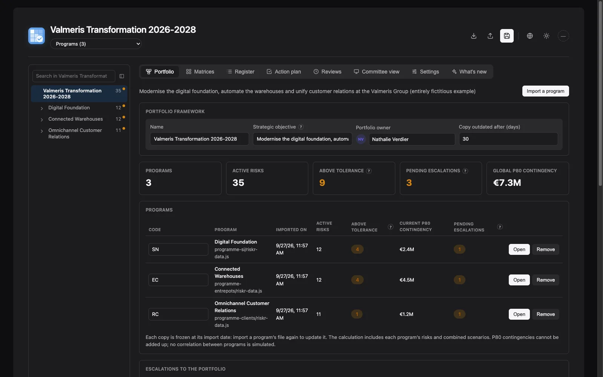

The detailed screenshots below use a smaller, fictional program fixture kept for reproducible captures in five languages. They illustrate the current interface; regenerate them with `node docs/captures/generer-captures.mjs` (Chrome required).

**Matrices**: before → after trajectory, target (blue diamond badge = target
reached, white diamond = target aimed for), risk appetite, state as of a review date.

<picture>
  <source media="(prefers-color-scheme: dark)" srcset="docs/captures/en/dark/matrices.webp">
  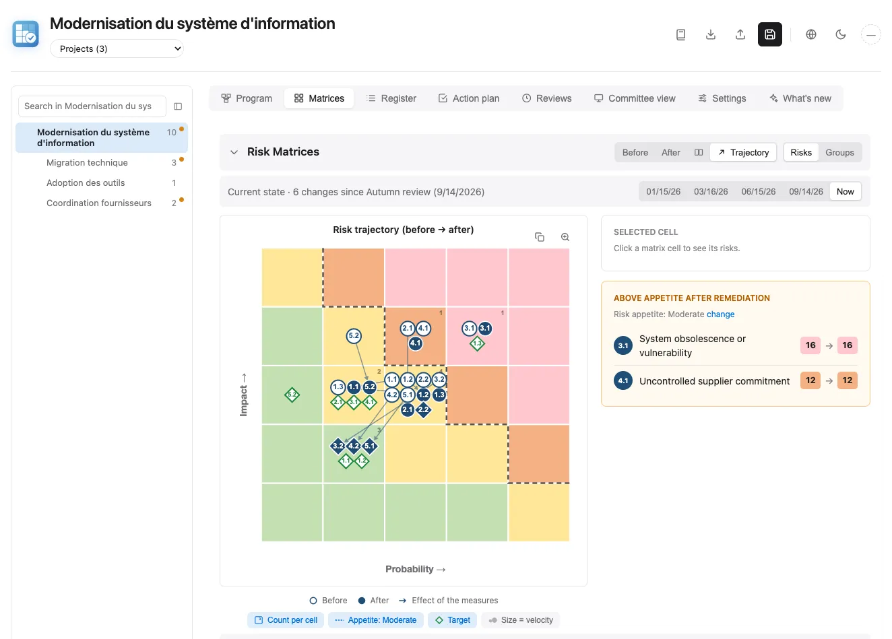
</picture>

<picture>
  <source media="(prefers-color-scheme: dark)" srcset="docs/captures/en/dark/matrices-groupes.webp">
  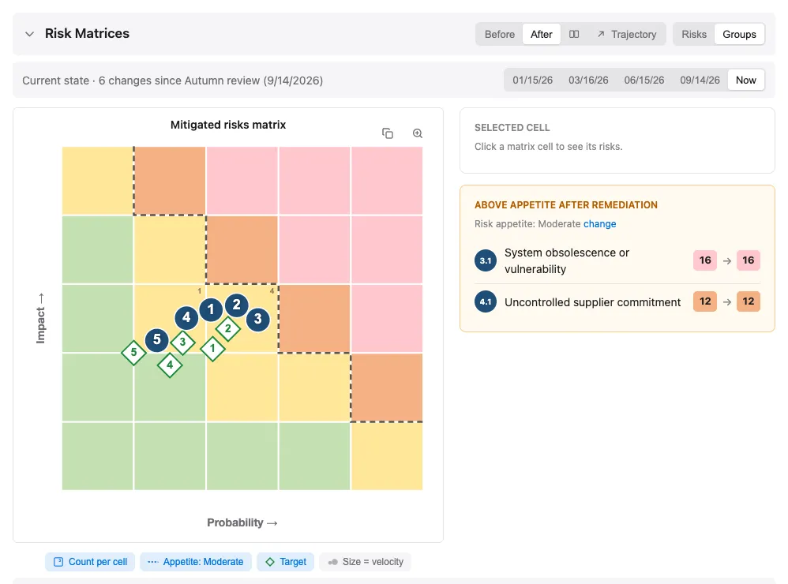
</picture>

**Register**: inherent → current → forecast → target ratings, trend across
reviews, treatment, owner, next due date and measures.

<picture>
  <source media="(prefers-color-scheme: dark)" srcset="docs/captures/en/dark/registre.webp">
  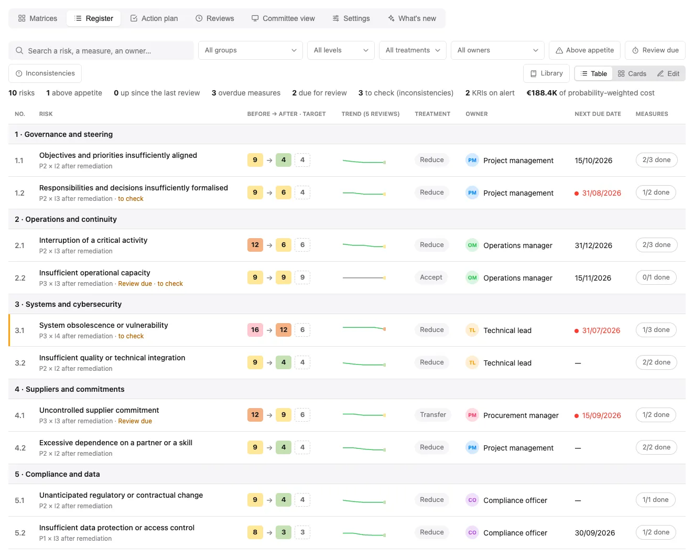
</picture>

**Risk sheet**: review cadence, bow-tie (causes, barriers and their
effectiveness, consequences), key risk indicators (KRI) with thresholds and readings,
costing in euros, rating trend, notes, links and change log.

<picture>
  <source media="(prefers-color-scheme: dark)" srcset="docs/captures/en/dark/fiche.webp">
  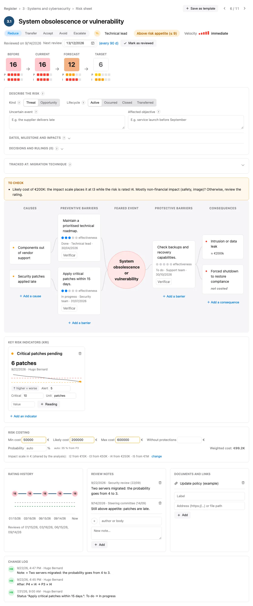
</picture>

**Action plan**: measures by status, owner or due date, overdue items highlighted;
a card can be dragged to the desired position or into another column to change
its status (status view) or its owner (owner view).

<picture>
  <source media="(prefers-color-scheme: dark)" srcset="docs/captures/en/dark/plan-actions.webp">
  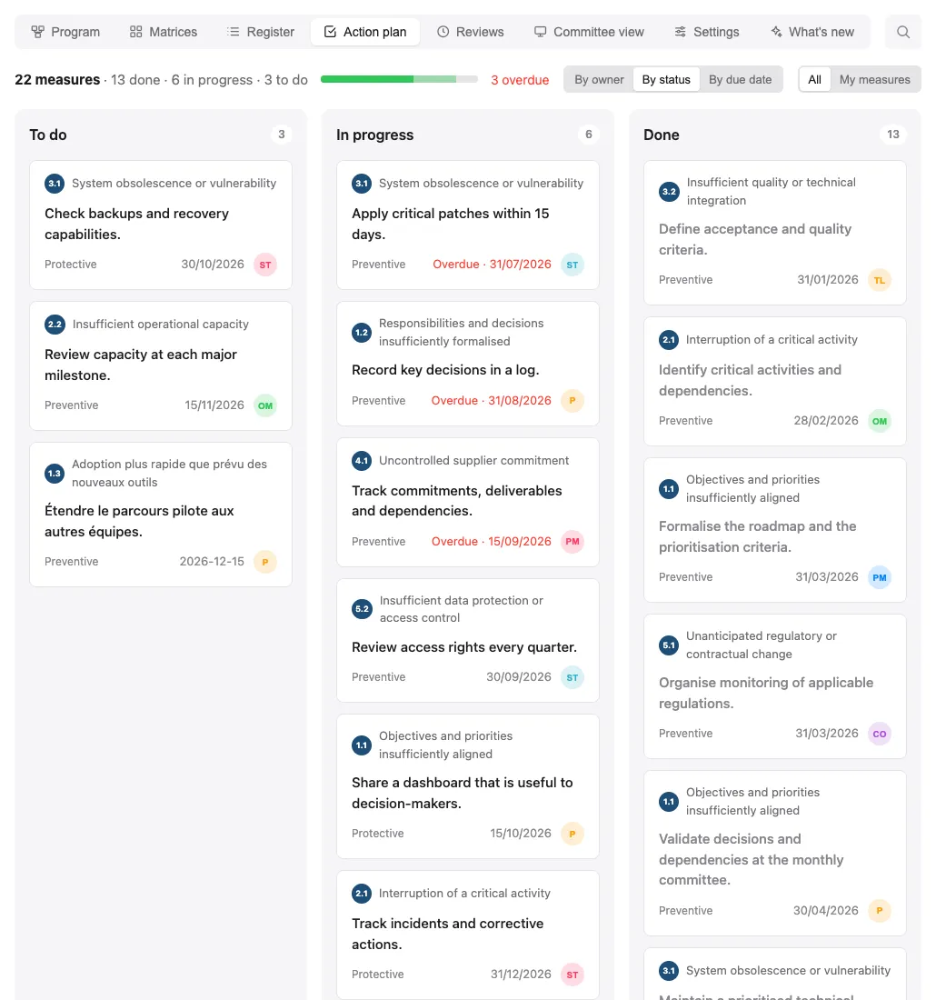
</picture>

**Reviews**: timeline of frozen reviews, review cadence, latest signed changes,
free comparison, rating changes and exposure by group.

<picture>
  <source media="(prefers-color-scheme: dark)" srcset="docs/captures/en/dark/revues.webp">
  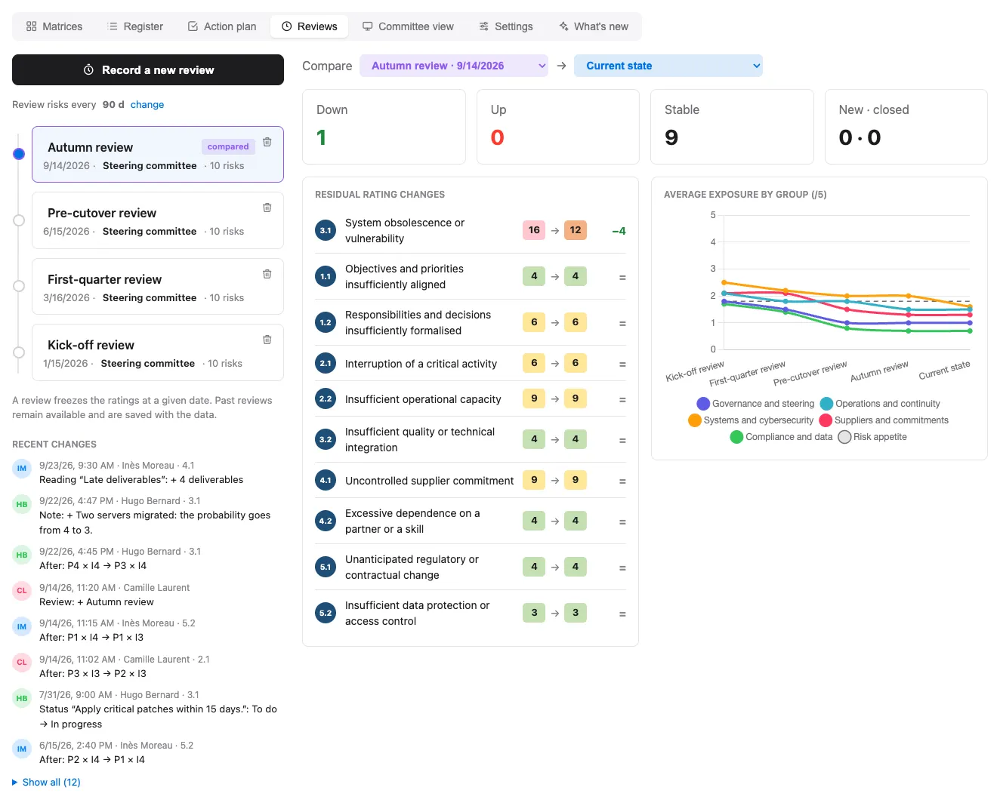
</picture>

**Committee view**: one-page summary (expected decisions, critical KRIs, risk
contingency by Monte Carlo simulation), copyable into Word or PowerPoint and exportable to PDF.

<picture>
  <source media="(prefers-color-scheme: dark)" srcset="docs/captures/en/dark/comite.webp">
  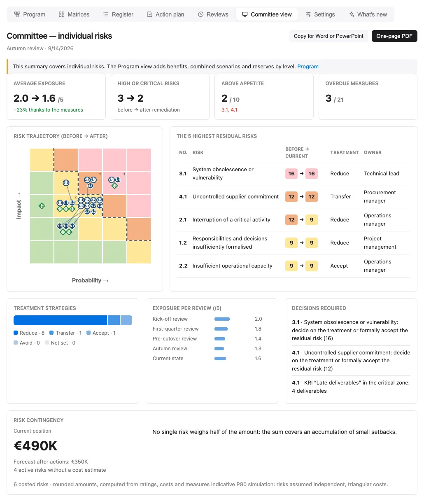
</picture>

**Settings**: settings shared by the whole analysis (risk appetite, review
cadence, effect of velocity on bubble size, impact scale in euros), recalled with
a "change" link wherever they are used.

<picture>
  <source media="(prefers-color-scheme: dark)" srcset="docs/captures/en/dark/parametres.webp">
  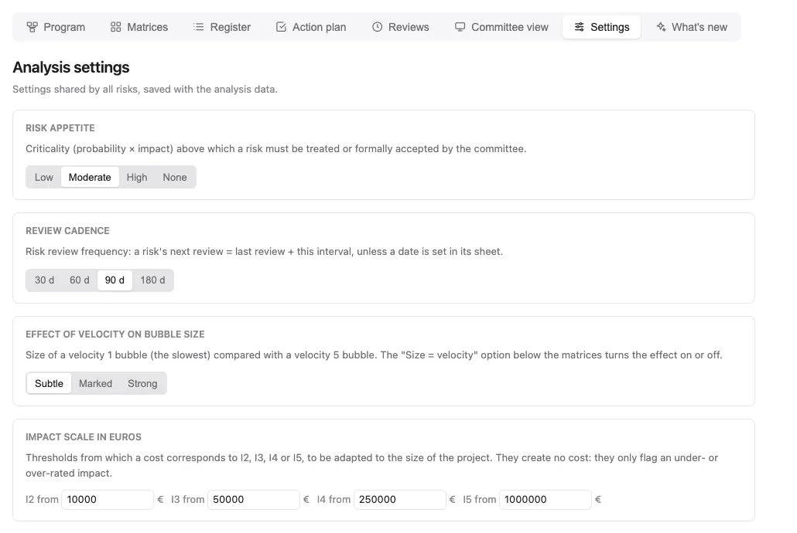
</picture>

**Program**: program page with its projects, benefits, escalations and reserves;
program › projects tree on the left with full-text search; breadcrumb below the title.

<picture>
  <source media="(prefers-color-scheme: dark)" srcset="docs/captures/en/dark/programme.webp">
  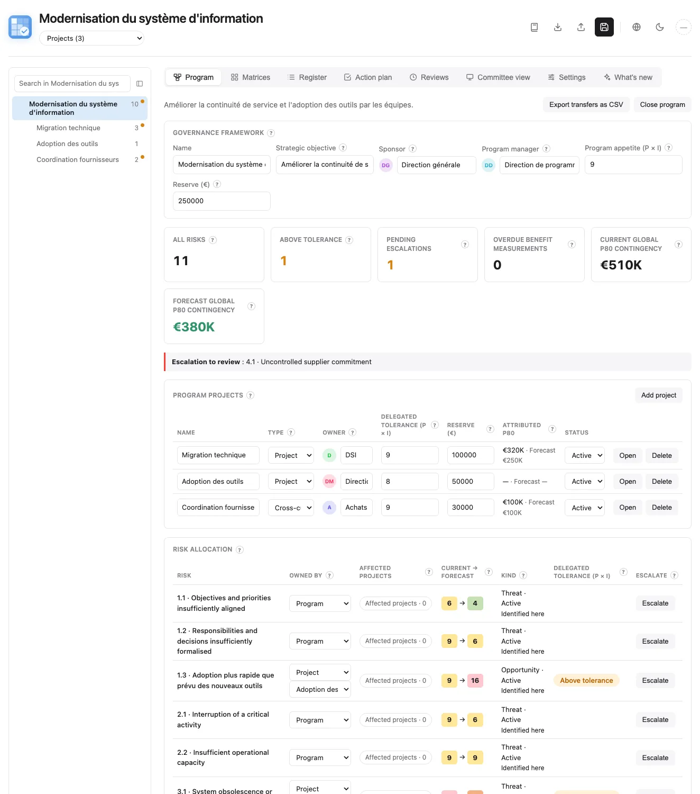
</picture>

**Portfolio**: several programs imported read-only, summary by program (active
risks, tolerance, contingency, freshness of the copy), escalations and rulings.

<picture>
  <source media="(prefers-color-scheme: dark)" srcset="docs/captures/en/dark/portefeuille.webp">
  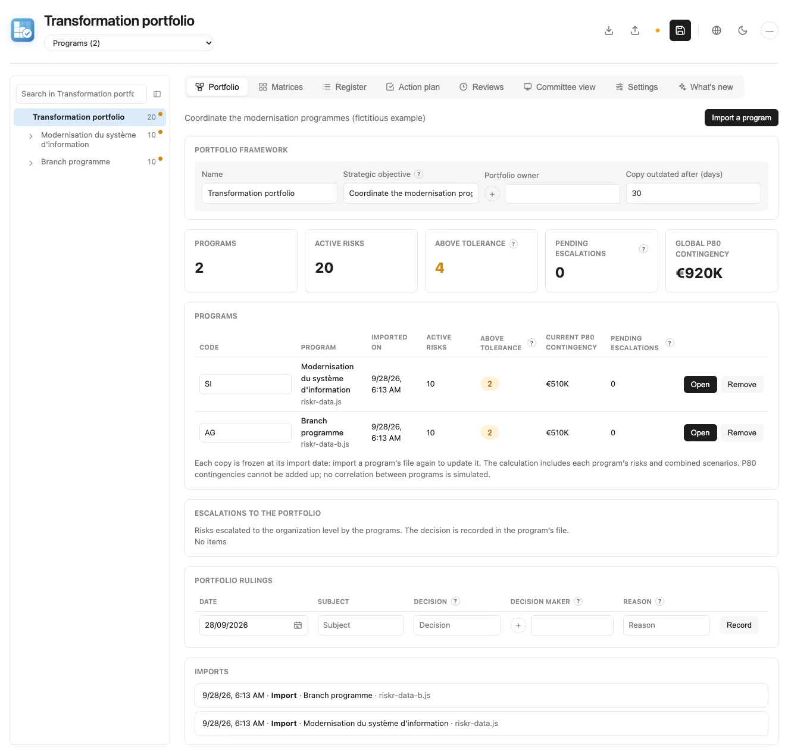
</picture>

## 📦 Separate data (riskr-data.js)

The data lives in `riskr-data.js` (`window.RISKR_DATA` format), loaded
automatically by `riskr.html`. The HTML is the engine and the data file is the
content: for a new analysis, only `riskr-data.js` changes.

- **Canonical format**: flat `risks[]` + `riskGroups[].riskIds`
- **Guaranteed round trip**: the JSON export and the `riskr-data.js` export
  (Export menu) produce this same format, which can be re-imported or reloaded
  as is next to the HTML
- Without `riskr-data.js`, the page shows a minimal placeholder (no sample data
  hidden in the HTML)
- When opened locally, `riskr-data.local.js` can override the generic data. It
  is ignored by Git and must only contain private data that must not be published.

Each risk has four ratings: `assessmentBefore` (inherent), `assessmentCurrent`
(observed), `assessmentAfter` (forecast after open actions), and
`assessmentTarget`, as `[probability, impact]`
(1 to 5; `[0, 0]` = not assessed). Criticality is probability × impact (out of 25);
it is shown scaled to 5 (score ÷ 5) in tables and matrices.
For legacy files with unfinished actions, the current rating conservatively
starts from the inherent rating and is flagged for review.

The data field names are in French (the application's original language):

- `mesures`: list of measures `{ texte, porteur, echeance, etat, verification }` (text, owner,
  due date, status; owner and due date are optional; `etat` is `todo`, `doing` or
  `done`; a plain text string is also accepted). A due date in `YYYY-MM-DD` or
  `DD/MM/YYYY` format that has passed on a measure not done marks it as overdue.
- `causes`: bow-tie texts; `consequences`: `{ texte, chiffrage }` (text, costing;
  a plain string is also accepted). Each measure also has `barriere`
  (`prevention` or `protection`), its side of the bow-tie, and `efficacite`
  (effectiveness, 0 to 5). `rang` (optional) keeps the position chosen by drag and
  drop in the action plan; without a rank, measures are sorted by delay then due date.
- `velocite`: speed from event to impact (1 to 5, 0 = not assessed), used by the
  "Size = velocity" option of the matrices. `proximityDate` separately records
  when the event may occur; `milestone` names the related milestone.
- `kind` distinguishes threats and opportunities; `impactAxes` scores cost,
  schedule, quality, service and benefit effects. `event`, `objective`,
  `raisedAt` and `raisedBy` record the uncertain event, affected objective and origin.
- `lifecycle` is `active`, `materialized`, `closed` or `transferred`;
  `lifeDate`, `lifeReason`, `transferOwner` and `issue` retain exit and issue details.
- `decisions` records dated decisions, the decision maker, reason, review date
  and accepted score. Expired or worsened acceptances require a new decision.
- `notes`: review notes `{ date, auteur, texte }` (date, author, text); `liens`:
  documents and links `{ libelle, url }` (label, URL).
- `settings.templates`: "My templates" of the library `{ titre, description,
  cotation, mesures }`.
- `uid`: stable internal identifier of a risk (generated automatically), used to
  follow a risk from one review to the next despite renumbering.
- `kri`: key risk indicators `{ id, nom, unite, sens, alerte, critique,
  releves: [{ date, valeur, auteur }] }` (name, unit, direction, alert and critical
  thresholds, readings); `sens` is `hausse` (the higher the value, the worse) or
  `baisse`; the latest reading gives the status (green, orange at the alert
  threshold, red at the critical threshold).
- `cout`: costing `{ min, probable, max, probabilite, sansProtection }` — cost in
  euros if the risk occurs (a single value is enough) and probability in %; when
  empty, the probability comes from the P rating after remediation (P1 to P5: 5,
  15, 35, 60, 85%). `sansProtection` (optional): likely cost if the risk occurred
  without the protection measures.
- `revuLe` / `prochaineRevue` (optional, `YYYY-MM-DD`): last declared review and
  chosen next review; `settings.cadenceRevue`: review the risks every N days (90 by default).
- `journal`: change log `{ id, date, auteur, uid, risque, champ, detail, avant,
  apres }`, filled in automatically at every change (2,000 lines at most). The
  Export menu offers "riskr-data.js · Without log" to share the analysis without
  these names and times.
- `reviews`: frozen reviews `{ id, date, label, auteur, note, risks: [{ uid, id,
  title, before, after, motif }] }`, dated snapshots of the ratings used for
  comparisons; `note` summarises the review and `motif` explains a rating.
- `statut` is `statusNotTreated`, `statusInProgress`, `statusTreated` or
  `statusAccepted`.
- `traitement` (strategy) is `reduce`, `accept`, `transfer`, `avoid`, `escalate`
  for threats, or `exploit`, `enhance`, `share`, `accept`, `escalate` for
  opportunities, or `''`
  (not defined); `assessmentTarget` is the target rating `[probability, impact]`
  (`[0, 0]` = not defined).
- `settings.riskAppetite`: maximum acceptable score (P × I, out of 25; `0` = none).
  9 by default, just below the "high" threshold. Drawn as a dotted line on the
  matrices; a residual risk above it is flagged in the register.
- The numbers (`1.1`, `1.2`…) follow the position of the risks and are
  recalculated after every addition, deletion or move.
- Default criticality thresholds: low 1-4, moderate 5-9, high 10-14,
  critical 15-25. They apply everywhere (matrices, badges, tables) and can be
  changed in `appState.criticalityThresholds`, for example
  `{ medium: 5, high: 10, critical: 15 }`.
- A group's average is the average criticality of its assessed risks, out of 5
  as in the summary table.
- Import also accepts older formats: risks nested in groups, older double ratings
  (`assessmentA*`/`assessmentB*`, `gcBefore`/`dtuBefore`…), statuses as text
  ("En cours"…). An invalid file is rejected without changing the analysis shown.

Each group can also have two summary fields for decision-makers:

- `assessmentNote`: short reading of the category;
- `remediationNote`: intended remediation.

Riskr limits these two texts to 30 words. The engine stays compatible with older
data files that do not contain them.

### Program risk management

The **Program** tab organizes an analysis around a strategic objective.
Legacy files without `program` remain project registers. A program contains
its **projects** (`components`, of type `project`, or `work` for cross-cutting
work that is not a project, such as supplier coordination), `benefits`,
`dependencies`, `scenarios`, `escalations`, `stages` and `decisions`. Risk
groups remain **thematic categories**.

The program name becomes the page title (clicking it goes back to the top); below it, a breadcrumb shows the path program › project; each level of the
path can be clicked to move up. The "Projects (n)" drop-down list at the end of
the path moves down to a project; its first option returns to the program.
Selecting a project limits the matrices, register, action plan, reviews and
committee view to the risks that project owns or is affected by. The first tab
follows the level and changes name: **Program** (program page with the list of
its projects) or **Project** (project figures and the risks it owns or is
affected by); the "Open" button on a project row moves down to its level. This
display choice is remembered by the browser and is not saved in the analysis.

Each risk retains one stable `uid` and one record. `scopeLevel` and
`componentId` identify its owning register; `affectedComponentIds` lists other
affected projects. A shared risk appears in several views but is sampled
only once in the global contingency. `programOrigin` and `programOriginNote`
record whether it was identified here, cascaded from the organization or
escalated from a project. Links use stable IDs, never display numbers.

Benefits have a baseline, target, actual value, owner, due date and linked
risks. A blank actual value means **to measure**, not zero. Delegated tolerance
flags risks for review; escalation and decisions remain dated human actions.
Project and program reserves are shown separately.
A monitoring decision records the observed score; another alert appears if
the risk worsens or moves to a different owning register.
An escalation accepted by the organization stays linked to its Riskr record
until explicit transfer; this product has no enterprise risk register.
Existing Riskr risk reviews also cover program risks; recent review dates and
notes are visible from the Program tab.

Dependencies connect two projects. Combined scenarios add an explicitly
entered **incremental cost** and probability; at least two active threats must
be linked before a scenario is costed. The P80 simulation does not model event
correlation. Project P80 values must not be added. Program estimates use
1,000 global draws and 250 draws per project to keep the tab responsive.
Before closure, active or
occurred risks must be transferred with an owner, date and reason; transfers
can be exported as CSV. The canonical data format retains all program data.

On a wide screen, a tree on the left shows the program (or portfolio), its programs and their projects, with the number of active risks and an orange dot when some are above tolerance. A click selects the level; each program or project gets back the tab and filters left there (a level never opened keeps the current view); an open risk sheet outside the new level closes. At the top of the panel, a full-text search covers the level shown (portfolio, program or project): risk sheets, measures, causes, consequences, notes, indicators, links, decisions, review reasons and program items, ignoring accents and case, with every typed word required in the same text; a result opens the matching sheet, page or review (up and down arrows to move, Enter to open). To the right of the tabs, a second search filters the open tab: register, action plan, reviews and changelog; when space is short it shrinks to a magnifier that opens on click. The panel spans the full page height; it can be collapsed and resized by dragging its edge (double-click: original width), and the browser remembers these choices.

### Portfolio management

A portfolio brings together several programs, each kept in its own file. It
contains `portfolio` (`uid`, `title`, `objective`, `owner`, `staleAfterDays`,
`programs`, `decisions`, `journal`) and no risks of its own (`risks` and
`riskGroups` are empty): the same `riskr.html` then switches to portfolio mode.
A file without `portfolio` works as before. A portfolio is created from the
Program tab of an analysis without a program (**Create a portfolio**).

**Import a program** reads a program's `riskr-data.js` or JSON export and keeps
a frozen copy in `programs` (program `uid`, `code`, `importedAt`, `source`,
`data`). Re-importing the same program replaces its copy after confirmation; a
file without a program is rejected. The browser never reads other folders: a
copy is updated only by a new import, and a copy older than `staleAfterDays`
(30 days by default) is flagged. Each program keeps ownership of its data:
copies are read-only (any risk change is undone with a message); corrections
are made in the program's file, then re-imported.

In the consolidated view only, display numbers are prefixed with the program
code (for example `NORD 1.1`) and stable IDs with the program `uid`. The
"Portfolio › program › project" breadcrumb restricts the matrices, register,
action plan, reviews and committee view; each level of the path can be clicked
to move up, and the "Programs (n)" or "Projects (n)" list at the end of the path
moves down one level (its first option returns to the parent level). The first
tab becomes **Portfolio** (list of programs), **Program** (read-only page of the
imported program: its projects, escalations and decisions) or **Project**; the
"Open" button on a program or project row moves down to its level.

The Program tab, renamed **Portfolio**, shows a summary per program (code,
import date, active risks, risks above tolerance, P80, pending escalations) and
a global P80 contingency simulated across all programs: per-program P80 values
do not add up, and no correlation between programs is modeled. It shows the
programs' organization-level escalations read-only (the decision is made in the
program's file), portfolio rulings (date, subject, decision, decision maker,
reason) and the import log. Program reviews are carried over, labeled with the
program code; no new review can be recorded from the portfolio.

## 🔌 100% offline

All libraries (chart.js 4.4.0, jsPDF 2.5.1, jspdf-autotable 3.8.2,
xlsx 0.18.5) are vendored inline in the HTML: no CDN dependency, the page works
entirely without a network (single file of about 2 MB).

## 🔒 Privacy

Riskr has no telemetry, account or automatic network request. Its libraries and icon are embedded in the HTML. Analyses are stored in this browser profile (localStorage and IndexedDB); saving to a file writes only to the file chosen by the user, and imports/exports happen on request. The optional GitHub and user-added document links contact their sites only when opened, without sending a referrer. Browser storage and exported files are readable by anyone with access to the same device or files: keep real analyses out of public repositories and use the ignored `riskr-data.local.js` for private work. The Valmeris example uses fictional names and reserved `.example` URLs.

## ✨ Features

### Tabbed layout
- **Matrices** (matrices, side panel, averages by group, summary table),
  **Register** (compact table, cards or full editing), **Action plan**,
  **Reviews**, **Committee view**, **Settings**, **What's new** (history of changes
  since the first version, with links to the commits); the selected tab is
  remembered and appears in the address (`riskr.html#revues`, `riskr.html#fiche:…`);
  the browser's Back / Forward buttons move from one tab or risk sheet to another
  without leaving the page. Clicking a matrix cell filters the register and the
  side panel.
- **Risk sheet** (click on a risk, address `riskr.html#fiche:<uid>`):
  before → after → target ratings, treatment, owner, velocity, linked bow-tie
  (barrier effectiveness, consequence costing), rating trend, review notes,
  documents and links, "Save as template".
- The older single-page version is still available through the Git tag
  `v-une-page`.

### Risk management
- **Inline editing** of all fields (titles, descriptions, categories)
- **Adding/deleting** risks and risk groups
- **Drag & drop** to reorder risks
- **Automatic numbering** based on position (addition, deletion, drag and drop)
- **Remediation measures** with owner, optional due date and status
  (to do, in progress, done); overdue dates shown in red
- **Action plan**: progress, measures grouped by status, owner or due date,
  "My measures", prevention / protection tag, overdue first, drag and drop of
  cards: order within the column kept, change of status (status view) or owner
  (owner view)
- **Declared identity**: badge at the top right (initials, stable colour per
  name, "—" if anonymous). The name is optional; while anonymous, it is asked for
  at the first change of each session (never when just browsing); it is kept in
  the browser, signs the change log and pre-fills the author of notes and
  reviews. No verification: it is declarative.
- **Change log**: who changed what and when (ratings, treatment, owner, measures,
  notes…), in the risk sheet and, for the whole analysis, in the Reviews tab
  ("Recent changes"); Undo also removes the matching line
- **Key risk indicators (KRI)**: in the risk sheet, quantified measurements per
  risk with alert and critical thresholds, dated and signed readings, sparkline;
  "KRI in alert" counter in the register, critical KRIs in the expected decisions
  of the committee view
- **Costing and risk contingency**: cost range per active threat in the sheet,
  and in the committee view (and PDF) the **current P80 contingency** and its
  forecast after actions. Opportunities and closed risks are excluded; active
  threats without costs are counted separately. The text is generated from
  ratings, costs and measures, with no
  statistical jargon: normal case (no big risk occurs), then for each big risk its
  cost if it occurs, the effect of its measures (probability "1 chance in 3 →
  1 chance in 7" for prevention, reduced cost for protection) and their progress.
  Computed from 10,000 Monte Carlo simulations (triangular distribution, stable results).
  The model assumes independent risks; it does not price correlations or combined scenarios.
- **Inconsistency detector**: "to check" alerts (nothing is blocked) when an
  entered probability falls outside the band of the P rating, when a cost does
  not match the impact rating according to the analysis's euro scale
  (`settings.echelleImpact`, set in the Settings tab), when a KRI is critical on a
  risk rated unlikely, or when ratings contradict each other; counter and filter
  in the register, details in the sheet
- **Review cadence**: each risk has a next review (chosen date, otherwise last
  review + a cadence of 30, 60, 90 or 180 days set in the Settings tab, and
  recalled in the Reviews tab and in the sheet); "Mark as reviewed" in the sheet;
  risks due for review are flagged and can be filtered in the register; reminders
  exported as `.ics` (Outlook, Google Calendar, Calendar)
- **Merging two files** (Import menu › "Merge a file…", JSON or `riskr-data.js`):
  lightweight multi-user. Risks are matched by stable identifier; a risk changed
  on both sides keeps the version whose latest change (change log) is the most
  recent, otherwise the local version (conflict reported); notes, links,
  readings, reviews and change log combined without duplicates. Summary to
  confirm before applying, can be undone (Cmd+Z)
- **Owner editable everywhere**: clicking the owner badge (register, action plan,
  sheet) opens the same picker with suggestions and badges, which also lets you
  create a new owner
- **Reviews**: dated snapshot of the ratings ("Record a new review", author or
  committee), timeline, comparison of two reviews or of a review with the current
  state (counters, changes sorted by difference), average exposure curve by group
  and trend per risk
- **Treatment strategy** (reduce, accept, transfer, avoid) and **target rating**
  per risk
- **Filters**: search, group, residual level, treatment, owner, risks above appetite
- **Categorisation** into thematic groups
- **Bow-tie** per risk: causes, preventive barriers, feared event, protection
  barriers, consequences (the barriers are the risk's measures)
- Built-in **library of typical risks** (offline, 6 themes, 5 languages,
  description and typical rating) and "My templates": added in a few clicks, with
  or without the suggested measures
- **Committee view** (tab): one-page summary (indicators, trajectory, 5 highest
  residual risks, treatments, exposure by review, expected decisions), copyable
  into Word or PowerPoint and exportable to a one-page PDF

### Visualisation
- **Before/After matrices** with Chart.js
- **Before, After, side-by-side or Trajectory matrices**: in the trajectory view,
  each risk goes from its before position (hollow bubble) to its after position
  (filled bubble)
- **Matrices as of a review date**: a timeline under the header shows the current
  state ("1 change since review no. 5") or any past review, read-only; matrices,
  panel and tables follow. The committee view and the PDF export stay on the
  current state.
- **Display**: a line below the matrices where each option carries its legend
  symbol (count per cell, appetite with its level set in the Settings tab, target
  as a green diamond, bubble size by velocity, with a subtle, marked or strong
  effect set in Settings; explanation on hover)
- **Side panel**: risks in the clicked cell and those above appetite
- **Target**: blue diamond badge = target reached; white diamond with a green
  outline, at its rating = target aimed for, not yet reached
- **Risk appetite** drawn as a dotted line, **number of risks per cell**
  (display options), click on a cell to filter the register
- Comparative view of the impact of remediation
- Averages by risk group
- Summary reading and remediation by group
- Interactive legend with colour codes
- Copy of the summary table to Word, with the rating colours
- Copy of a matrix as an image (title, matrix and legend) to paste elsewhere

### History
- **Undo/Redo** up to 50 steps (Cmd+Z / Cmd+Y on Mac, Ctrl+Z / Ctrl+Y on Windows/Linux)
- Every change (rating, text, status, addition, deletion, move, import) is recorded

### Data persistence
- **Saving to the file**: in Chrome/Edge, click "Save to file" once, then every
  change is written automatically to `riskr-data.js` (or `riskr-data.local.js` if
  the analysis comes from the private file). In Firefox/Safari, the "Save" button
  downloads the file to replace next to `riskr.html`. An indicator shows the
  status, and closing the page asks for confirmation if changes are unsaved.
- **localStorage**: the whole analysis is also saved in the browser at every
  change and restored on reload
- If `riskr-data.js` is changed between two openings, **the file takes over** and
  the changes made in the browser are discarded (a message says so): export
  before replacing the file
- **JSON export/import** for sharing and backup
- No server connection required

### Interface
- **Responsive design** for mobile, tablet and desktop
- **Collapsible sections** for easier navigation
- Smooth **inline editing** with visual feedback
- **Light and dark themes**: follows the system setting, switch with the sun/moon
  icon (preference kept in the browser). Image copies and the PDF stay in the
  light version
- **Icon commands** (import, export, save, language, theme), labels in tooltips
- **5 languages**: French, English, Spanish, Arabic (right to left) and Chinese.
  The PDF uses English for Arabic and Chinese (jsPDF Latin fonts)

## 🚀 Usage

**Riskr is a one-page application.** Its engine is a self-contained HTML file; the sample data is separate.

1. Download `riskr.html` and `riskr-data.js` into the same folder.
2. Open `riskr.html` in your browser to explore the Valmeris portfolio.
3. To use another example, replace the data file with one from `examples/valmeris/`. No installation is required.

## 🛠️ Tech stack

### Frontend
- **HTML5** - Semantic structure
- **CSS3** - Modern styles with flexbox/grid
- **JavaScript (ES6+)** - Vanilla JS, no framework dependency

### Libraries
- **Chart.js** - Risk matrix visualisation
- jsPDF, jspdf-autotable and SheetJS are also embedded in the HTML; no runtime CDN is used.

### Persistence
- **localStorage** - Native browser storage, isolated per analysis
- JSON format for import/export

### Architecture
- **One-page application** - Everything in a single HTML file
- No build or bundler required
- Works offline once loaded

## 📄 License

This project is licensed under the **GNU Affero General Public License v3.0 (AGPL-3.0)**.

### License summary
- ✅ Free to use, modify and distribute
- ✅ Source code available and modifiable
- ⚠️ **Important for SaaS**: if you run Riskr on a server accessible over a network (SaaS), you must share the modified source code with your users

See the [LICENSE](LICENSE) file for details.

## 🤝 Contributing

Contributions are welcome!

1. Fork the project
2. Create a branch for your feature (`git checkout -b feature/AmazingFeature`)
3. Commit your changes (`git commit -m 'Add some AmazingFeature'`)
4. Push to the branch (`git push origin feature/AmazingFeature`)
5. Open a Pull Request

## 📞 Support

For any question or suggestion:
- Open an [issue](https://github.com/guthubrx/Riskr/issues)
- See the documentation in the source code

---

© 2025 Riskr — Risk analysis and risk mapping application
