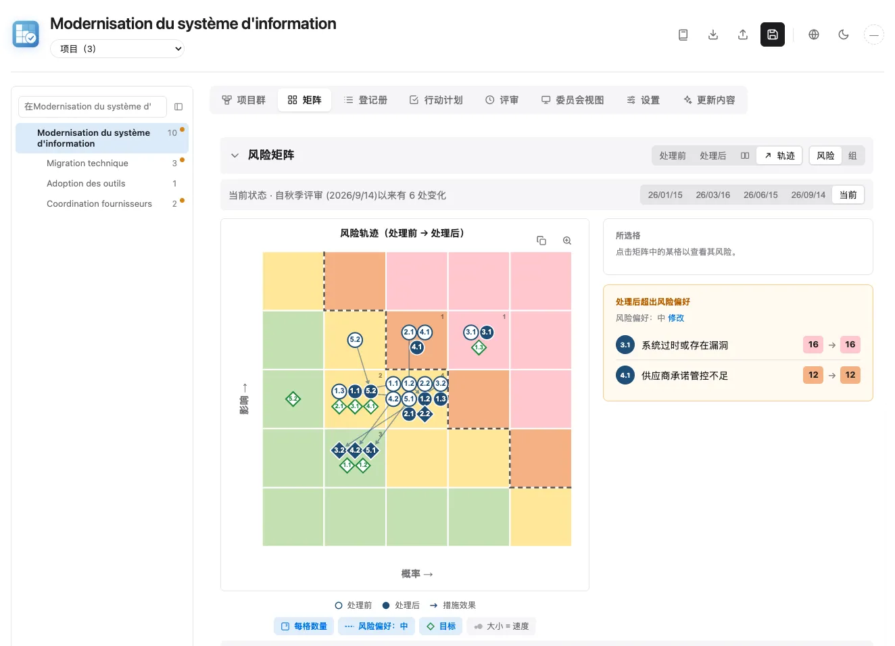
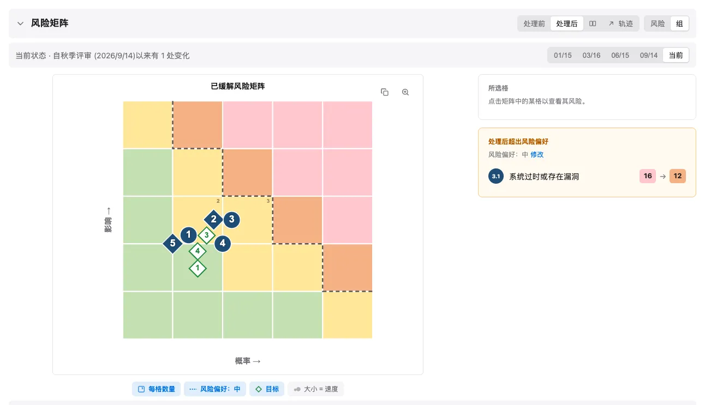
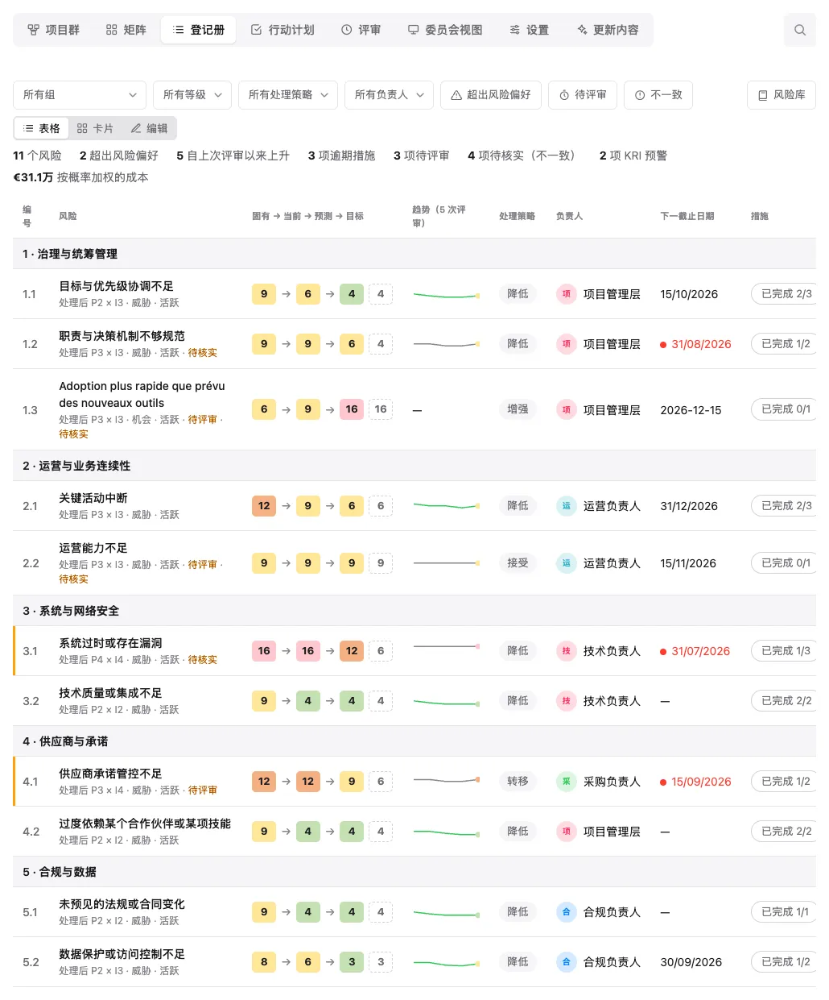
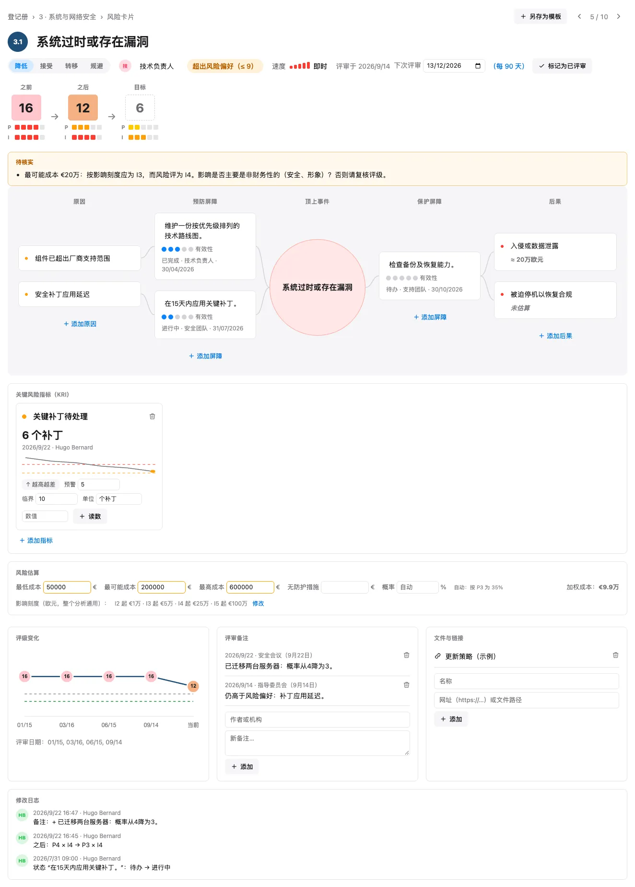
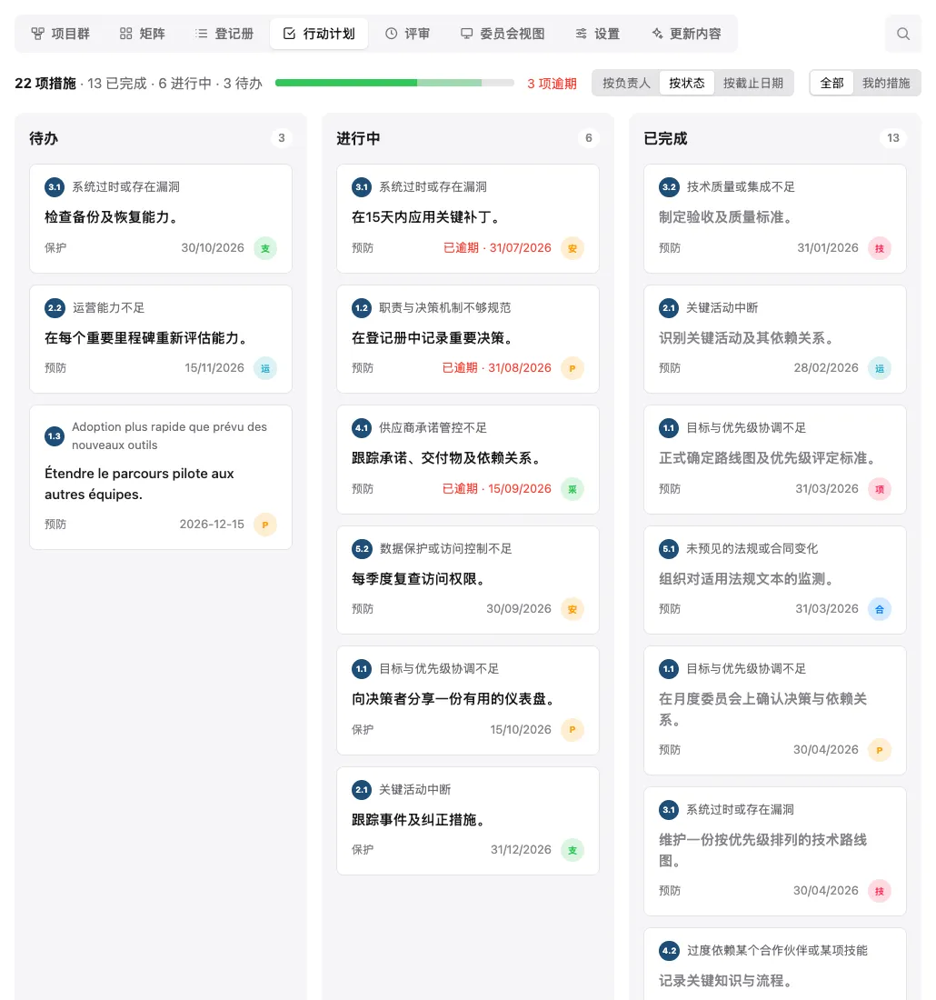
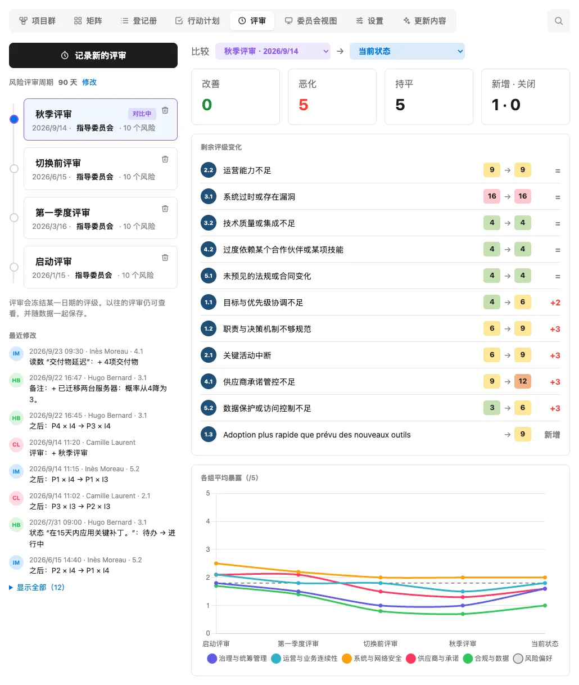
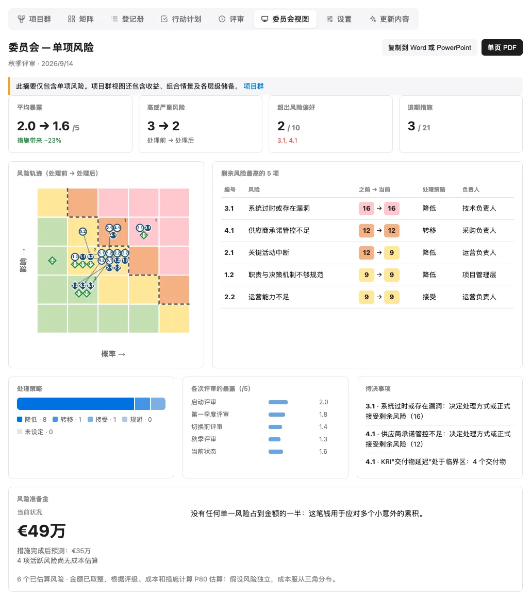
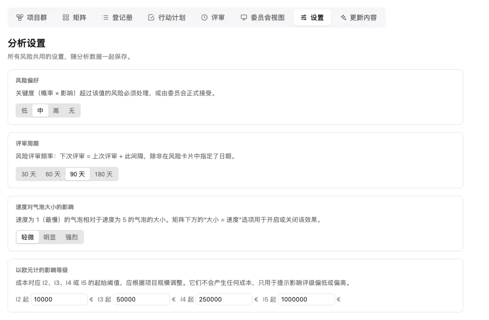

  
  <h1>Riskr</h1>
  
用于风险分析与风险地图绘制的网页应用，提供处理前/处理后矩阵和协同管理。

  <a href="README.md">🇬🇧 English</a> ·
  <a href="README.fr.md">🇫🇷 Français</a> ·
  <a href="README.es.md">🇪🇸 Español</a> ·
  <a href="README.zh.md">🇨🇳 中文</a> ·
  <a href="README.ar.md">🇸🇦 العربية</a>

## 📋 简介

**Riskr** 是一个完整的单页网页应用，用于风险分析与风险管理。它通过交互式矩阵和详细表格，展示风险在整改措施实施前后的演变情况。

## 🖼️ 截图

截图使用 `riskr-data.js` 中的演示数据，该数据完全是虚构的（一个信息系统现代化改造的假想项目），以浅色主题展示。本 README 的每个语言版本都配有其自身语言的截图（界面和演示数据均为该场合专门翻译，见 `docs/captures/traductions/`）。界面变更后如需重新生成截图：`node docs/captures/generer-captures.mjs`（需要 Chrome）。

**矩阵**：处理前 → 处理后轨迹、目标（蓝色菱形徽章 = 已达成目标，白色菱形 = 目标方向），风险偏好，某评审日期时的状态。

<picture>
  
</picture>

<picture>
  
</picture>

**登记册**：处理前 → 处理后评级 · 目标、跨评审趋势、处理策略、负责人、下次到期日期和措施。

<picture>
  
</picture>

**风险卡片**：评审节奏、蝴蝶结分析图（原因、屏障及其有效性、后果）、带阈值和读数的关键风险指标（KRI）、以欧元计的成本估算、评级趋势、备注、链接和变更记录。

<picture>
  
</picture>

**行动计划**：按状态、负责人或到期日期划分的措施，逾期项目高亮显示；卡片可拖拽到指定位置，或拖入另一列以更改其状态（状态视图）或负责人（负责人视图）。

<picture>
  
</picture>

**评审**：已冻结评审的时间线、评审节奏、最新签署的变更、自由比较、评级变化以及按组划分的敞口。

<picture>
  
</picture>

**委员会视图**：单页摘要（待决事项、关键 KRI、蒙特卡洛模拟计算的风险准备金），可复制到 Word 或 PowerPoint，也可导出为 PDF。

<picture>
  
</picture>

**设置**：整个分析共用的设置（风险偏好、评审节奏、速度对气泡大小的影响、以欧元计的影响刻度），在任何使用处均可通过“修改”链接回溯查看。

<picture>
  
</picture>

## 📦 数据分离（riskr-data.js）

数据存放在 `riskr-data.js`（`window.RISKR_DATA` 格式）中，由 `riskr.html` 自动加载。HTML 是引擎，数据文件才是内容：进行一次新的分析时，只需更改 `riskr-data.js`。

- **规范格式**：扁平化的 `risks[]` + `riskGroups[].riskIds`
- **往返保证**：JSON 导出与 `riskr-data.js` 导出（导出菜单）产生相同的格式，可原样重新导入或放在 HTML 旁重新加载
- 没有 `riskr-data.js` 时，页面显示最简占位内容（HTML 中不隐藏任何示例数据）
- 在本地打开时，`riskr-data.local.js` 可以覆盖通用数据。该文件被 Git 忽略，只能包含不应公开的私密数据。

每个风险有四个评级：`assessmentBefore`（固有）、`assessmentCurrent`
（当前观察）、`assessmentAfter`（完成未结措施后的预测）和
`assessmentTarget`（目标），格式为 `[probability, impact]`
（1 到 5；`[0, 0]` = 未评估）。严重性为可能性 × 影响（满分 25）；
在表格和矩阵中按满分 5 折算显示（得分 ÷ 5）。
对于仍有未完成措施的旧版文件，当前评级出于谨慎沿用固有评级，
并被标记为待复核。

数据字段名使用法语（应用的原始语言）：

- `mesures`：措施列表 `{ texte, porteur, echeance, etat, verification }`（文本、负责人、
  到期日期、状态；负责人和到期日期为可选；`etat` 为 `todo`、`doing` 或
  `done`；也接受纯文本字符串）。未完成措施的 `YYYY-MM-DD` 或
  `DD/MM/YYYY` 格式的到期日期一旦过期，就会被标记为逾期。
- `causes`：蝴蝶结分析图的原因文本；`consequences`：`{ texte, chiffrage }`（文本、成本估算；
  也接受纯字符串）。每项措施还带有 `barriere`
  （`prevention` 或 `protection`），表示其在蝴蝶结分析图中的所属侧，以及 `efficacite`
  （有效性，0 到 5）。`rang`（可选）保留在行动计划中通过拖拽
  选定的位置；没有排名时，措施按延迟再按到期日期排序。
- `velocite`：从事件发生到产生影响的速度（1 到 5，0 = 未评估），供矩阵中的
  “大小 = 速度”选项使用。`proximityDate` 单独记录事件可能发生的时间；
  `milestone` 指明相关的里程碑。
- `kind` 区分威胁与机会；`impactAxes` 对成本、进度、质量、服务和
  收益方面的影响分别评级。`event`、`objective`、`raisedAt` 和 `raisedBy`
  记录不确定事件、受影响的目标及其来源。
- `lifecycle` 为 `active`、`materialized`、`closed` 或 `transferred`；
  `lifeDate`、`lifeReason`、`transferOwner` 和 `issue` 保留退出信息及
  风险发生后的问题信息。
- `decisions` 记录带日期的决定，包括决策人、理由、复审日期和
  所接受的分数。已过期或已恶化的接受决定需要重新决策。
- `notes`：评审备注 `{ date, auteur, texte }`（日期、作者、文本）；`liens`：
  文档和链接 `{ libelle, url }`（标签、URL）。
- `settings.templates`：风险库中的“我的模板” `{ titre, description,
  cotation, mesures }`。
- `uid`：风险的稳定内部标识符（自动生成），用于
  在重新编号后仍能跨评审追踪同一风险。
- `kri`：关键风险指标 `{ id, nom, unite, sens, alerte, critique,
  releves: [{ date, valeur, auteur }] }`（名称、单位、方向、预警和临界
  阈值、读数）；`sens` 为 `hausse`（数值越高越差）或
  `baisse`；最新读数决定状态（绿色，达到预警阈值为橙色，
  达到临界阈值为红色）。
- `cout`：成本估算 `{ min, probable, max, probabilite, sansProtection }` — 风险
  发生时的成本（欧元，填一个值即可）及概率（%）；留空时，
  概率由整改后的 P 评级推算（P1 至 P5：5、15、35、60、85%）。
  `sansProtection`（可选）：若没有防护措施时风险发生的可能成本。
- `revuLe` / `prochaineRevue`（可选，`YYYY-MM-DD`）：已声明的上次评审和
  选定的下次评审；`settings.cadenceRevue`：每 N 天评审一次风险（默认 90 天）。
- `journal`：变更记录 `{ id, date, auteur, uid, risque, champ, detail, avant,
  apres }`，每次变更时自动填写（最多 2000 行）。
  导出菜单中的“riskr-data.js · 不含日志”选项可在分享分析时
  隐藏这些姓名和时间。
- `reviews`：已冻结评审 `{ id, date, label, auteur, note, risks: [{ uid, id,
  title, before, after, motif }] }`，用于比较的带日期评级快照；`note` 概述评审，`motif` 说明评级理由。
- `statut` 为 `statusNotTreated`、`statusInProgress`、`statusTreated` 或
  `statusAccepted`。
- `traitement`（策略）对威胁为 `reduce`、`accept`、`transfer`、`avoid`、`escalate`，
  对机会为 `exploit`、`enhance`、`share`、`accept`、`escalate`，或为 `''`
  （未定义）；`assessmentTarget` 为目标评级 `[probability, impact]`
  （`[0, 0]` = 未定义）。
- `settings.riskAppetite`：可接受的最高分数（P × I，满分 25；`0` = 无）。
  默认值为 9，略低于“高”阈值。在矩阵上以虚线表示；
  超出该值的剩余风险会在登记册中被标记。
- 编号（`1.1`、`1.2`……）遵循风险的位置，在每次新增、
  删除或移动后重新计算。
- 默认严重性阈值：低 1-4、中等 5-9、高 10-14、
  严重 15-25。它们在各处生效（矩阵、徽章、表格），可在
  `appState.criticalityThresholds` 中修改，例如
  `{ medium: 5, high: 10, critical: 15 }`。
- 一个组的平均值是其已评估风险的平均严重性，满分为 5，
  与摘要表中一致。
- 导入还支持较旧的格式：嵌套在组内的风险、旧版的双重评级
  （`assessmentA*`/`assessmentB*`、`gcBefore`/`dtuBefore`……）、以文本表示的状态
  （“En cours”……）。无效文件会被拒绝，且不会更改当前显示的分析。

每个组还可以有两个供决策者阅读的摘要字段：

- `assessmentNote`：该类别的简要解读；
- `remediationNote`：预定的整改方向。

Riskr 将这两段文本限制在 30 个词以内。引擎与不包含这两个字段的
旧版数据文件保持兼容。

### 项目群风险管理

**项目群**标签围绕一个战略目标组织分析。
不含 `program` 的旧版文件仍作为项目登记册使用。一个项目群包含其
**项目**（`components`，类型为 `project`；或 `work`，表示不属于任何项目的
跨项目工作，例如供应商协调）、`benefits`、`dependencies`、`scenarios`、
`escalations`、`stages` 和 `decisions`。风险组仍然是**主题类别**。

项目群名称成为页面标题（点击即可回到顶层）；其下方的导航路径显示“项目群 › 项目”路径；点击路径中的任一层级即可
返回上层。路径末端的“项目（n）”下拉列表可进入某个项目；其第一个选项
返回项目群。选择某个项目后，矩阵、登记册、行动计划、评审和委员会视图
将只显示该项目负责或受其影响的风险。第一个标签随层级变化并更名：
**项目群**（项目群页面及其项目列表）或**项目**（该项目的数据及其负责
或受其影响的风险）；项目行上的“打开”按钮可进入该项目层级。该显示选择
由浏览器记住，不会保存到分析中。

每个风险只保留一个稳定的 `uid` 和一张卡片。`scopeLevel` 和
`componentId` 标识其所属登记册；`affectedComponentIds` 列出受影响的其他
项目。共享风险会出现在多个视图中，但在整体准备金中只抽样一次。
`programOrigin` 和 `programOriginNote` 记录该风险是在此识别、
由组织层级分解而来，还是由项目上报。链接始终使用稳定标识符，
而不是显示编号。

收益包含基准值、目标值、实际值、负责人、到期日期和关联风险。
实际值为空表示**待测量**，而不是零。授权容忍度会将风险标记为待复核；
上报和决定仍是带日期的人工操作。项目准备金和项目群准备金分开显示。
跟踪决定会记录观察到的分数；如果该风险恶化或转入另一个所属登记册，
会再次出现警报。
被组织接受的上报在明确移交之前仍与其 Riskr 记录保持关联；
本产品不包含企业风险登记册。
Riskr 现有的风险评审同样涵盖项目群风险；最近的评审日期和备注
可在项目群标签中查看。

依赖关系连接两个项目。组合情景会增加一个明确输入的**增量成本**
和概率；至少关联两个活跃威胁后，情景才会被估价。P80 模拟不对
事件之间的相关性建模。各项目的 P80 值不能相加。为保持标签响应迅速，
项目群估算在整体层面使用 1000 次抽样，每个项目使用 250 次抽样。
结束之前，活跃或已发生的风险必须连同负责人、日期和理由一起移交；
移交记录可导出为 CSV。规范数据格式保留所有项目群数据。

在宽屏上，左侧的树状导航显示项目群（或项目组合）、其下的项目群和项目，并标出活跃风险数量；若有风险超出容忍度，则显示橙色圆点。点击即可切换层级；每个项目群或项目会恢复上次停留的标签页和筛选条件（从未打开过的层级沿用当前视图）；不属于新层级的已打开风险卡片会自动关闭。面板顶部的全文搜索只在当前层级（项目组合、项目群或项目）内进行：风险卡片、措施、原因、后果、备注、指标、链接、决定、评审理由以及项目群要素；不区分重音和大小写，输入的所有词都须出现在同一段文字中；点击结果即可打开对应的卡片、页面或评审（上下方向键浏览，回车打开）。标签页右侧的第二个搜索框用于筛选当前标签页：风险登记册、行动计划、评审和更新记录；空间不足时缩为放大镜图标，点击即可展开。面板占满页面高度；可以收起，也可以拖动边缘调整宽度（双击恢复原始宽度），浏览器会记住这些选择。

### 项目组合管理

项目组合汇集多个项目群，每个项目群保存在各自的文件中。项目组合文件包含
`portfolio`（`uid`、`title`、`objective`、`owner`、`staleAfterDays`、
`programs`、`decisions`、`journal`），自身不含任何风险（`risks` 和
`riskGroups` 为空）：同一个 `riskr.html` 随即切换到项目组合模式。不含
`portfolio` 的文件照常运行。在不含项目群的分析中，可从项目群标签创建
项目组合（**创建项目组合**）。

**导入项目群**读取某个项目群的 `riskr-data.js` 或 JSON 导出，并在
`programs` 中保存一份固定副本（项目群的 `uid`、`code`、`importedAt`、
`source`、`data`）。重新导入同一项目群时，确认后替换其副本；不含项目群的
文件会被拒绝。浏览器从不读取其他文件夹：副本只能通过重新导入更新；导入
时间超过 `staleAfterDays`（默认 30 天）的副本会被标记。每个项目群仍是其
数据的所有者：副本为只读（对风险的任何修改都会被撤销并显示提示）；应在
项目群文件中修改，然后重新导入。

仅在汇总视图中，显示编号会加上项目群代码前缀（例如 `NORD 1.1`），稳定
标识符则加上项目群的 `uid` 前缀。“项目组合 › 项目群 › 项目”导航路径可
限定矩阵、登记册、行动计划、评审和委员会视图；点击路径中的任一层级即可
返回上层，路径末端的“项目群（n）”或“项目（n）”列表可进入下一层级（其
第一个选项返回上一层级）。第一个标签变为**项目组合**（项目群列表）、
**项目群**（所导入项目群的只读页面：其项目、上报和决定）或**项目**；项目群
或项目行上的“打开”按钮可进入其层级。

项目群标签更名为**项目组合**，显示各项目群的汇总（代码、导入日期、活跃
风险、超出容忍度的风险、P80、待处理上报）以及基于全部项目群模拟的整体
P80 准备金：各项目群的 P80 不能相加，也不对项目群之间的相关性建模。该
标签以只读方式列出各项目群上报至组织层级的风险（决定需在项目群文件中
做出）、项目组合决策（日期、主题、决定、决策人、理由）以及导入记录。
各项目群的评审会一并显示，并标注项目群代码；不能从项目组合记录新的评审。

## 🔌 100% 离线

所有库（chart.js 4.4.0、jsPDF 2.5.1、jspdf-autotable 3.8.2、
xlsx 0.18.5）都以内联方式打包进 HTML：不依赖任何 CDN，
页面在完全无网络的情况下也能正常运行（单个文件约 2 MB）。

## ✨ 功能

### 标签式布局
- **矩阵**（矩阵图、侧边面板、按组平均值、摘要表）、
  **登记册**（紧凑表格、卡片或完整编辑）、**行动计划**、
  **评审**、**委员会视图**、**设置**、**更新内容**（自首个版本以来的变更
  历史，附带指向对应提交的链接）；所选标签会被记住并显示在
  地址栏中（`riskr.html#revues`、`riskr.html#fiche:…`）；
  浏览器的“后退 / 前进”按钮可在各标签或风险卡片之间切换，
  而无需离开页面。点击矩阵单元格可筛选登记册和
  侧边面板。
- **风险卡片**（点击某个风险，地址为 `riskr.html#fiche:<uid>`）：
  处理前 → 处理后 → 目标评级、处理策略、负责人、速度、关联的蝴蝶结分析图
  （屏障有效性、后果成本估算）、评级趋势、评审备注、
  文档和链接、“另存为模板”。
- 旧版单页版本仍可通过 Git 标签 `v-une-page` 获取。

### 风险管理
- 对所有字段（标题、描述、类别）进行**内联编辑**
- **新增/删除**风险和风险组
- **拖拽排序**风险
- 基于位置的**自动编号**（新增、删除、拖拽）
- 带负责人、可选到期日期和状态
  （待办、进行中、已完成）的**整改措施**；逾期日期以红色显示
- **行动计划**：进度、按状态/负责人/到期日期分组的措施、
  “我的措施”、预防/防护标签、逾期项优先显示、卡片
  拖拽：列内顺序保留，可更改状态（状态视图）或负责人
  （负责人视图）
- **声明式身份**：右上角徽章（姓名首字母，每个姓名对应稳定颜色，
  匿名时显示“—”）。姓名为可选项；在匿名状态下，会在每次
  会话的首次修改时询问（仅浏览时不会询问）；该姓名保存在
  浏览器中，用于签署变更记录，并预填备注和评审的作者。
  没有任何验证：这是一种自我声明。
- **变更记录**：谁在何时更改了什么（评级、处理策略、负责人、措施、
  备注……），显示在风险卡片中，对整个分析而言则显示在
  “评审”标签（“最新变更”）中；撤销操作也会移除相应的记录行
- **关键风险指标（KRI）**：在风险卡片中，每个风险的量化指标，
  带预警和临界阈值、带日期并签名的读数、迷你趋势图；
  登记册中的“预警中的 KRI”计数器，委员会视图待决事项中的
  临界 KRI
- **成本估算与风险准备金**：卡片中每个活跃威胁的成本区间，
  以及委员会视图（和 PDF）中的**当前 P80 准备金**及其在措施完成后的
  预测值。机会和已关闭的风险不计入；没有成本的活跃威胁单独计数。文本根据评级、
  成本和措施自动生成，不含统计学术语：先是正常情形
  （未发生重大风险），再针对每个重大风险给出其发生时的成本、
  措施带来的效果（预防措施使概率从“3 次中 1 次”降为
  “7 次中 1 次”，防护措施降低发生时的成本）及其进度。
  基于 10000 次蒙特卡洛模拟计算（三角分布，结果稳定）。
  该模型假定各风险相互独立，不对相关性或组合情景进行估价。
- **不一致检测器**：当输入的概率超出 P 评级的区间、
  成本按分析的欧元刻度（在“设置”标签中设置的
  `settings.echelleImpact`）与影响评级不符、KRI 在评为
  不太可能的风险上处于临界状态，或评级之间相互矛盾时，
  会出现“待核实”提示（不会阻止任何操作）；登记册中有计数器
  和筛选项，详情见风险卡片
- **评审节奏**：每个风险都有下次评审时间（选定日期，
  否则为上次评审加上在“设置”标签中设置的 30、60、90 或
  180 天节奏，并在“评审”标签和卡片中回显）；卡片中的
  “标记为已评审”；到期待评审的风险会被标记，并可在登记册中
  筛选；提醒可导出为 `.ics`（Outlook、Google 日历、日历）
- **合并两个文件**（导入菜单 ›“合并文件…”，JSON 或 `riskr-data.js`）：
  轻量级多用户协作。风险按稳定标识符匹配；同一风险
  在两边都有变更时，保留变更记录中最新变更时间更靠后的版本，
  否则保留本地版本（并报告冲突）；备注、链接、
  读数、评审和变更记录会去重合并。应用前会显示摘要以供确认，
  且可撤销（Cmd+Z）
- **随处可编辑负责人**：点击负责人徽章（登记册、行动计划、
  卡片）会打开同一个带建议和徽章的选择器，也可以在其中
  创建新的负责人
- **评审**：带日期的评级快照（“记录新的评审”，作者或
  委员会）、时间线、两次评审之间或某次评审与当前状态之间的
  比较（计数器、按差异排序的变更）、按组划分的平均敞口曲线
  以及每个风险的趋势
- 每个风险的**处理策略**（降低、接受、转移、规避）和**目标评级**
- **筛选**：搜索、组、剩余等级、处理策略、负责人、超出风险偏好的风险
- 按主题**分类**为不同的组
- 每个风险的**蝴蝶结分析图**：原因、预防屏障、危险事件、防护
  屏障、后果（屏障即该风险的措施）
- 内置**典型风险库**（离线，6 个主题，5 种语言，
  含描述和典型评级）以及“我的模板”：只需几次点击即可添加，
  可选择是否附带建议措施
- **委员会视图**（标签）：单页摘要（指标、轨迹、剩余风险最高的
  5 项、处理策略、按评审的敞口、待决事项），可复制到
  Word 或 PowerPoint，也可导出为单页 PDF

### 可视化
- 基于 Chart.js 的**处理前/处理后矩阵**
- **处理前、处理后、并排或轨迹矩阵**：在轨迹视图中，
  每个风险从其处理前位置（空心气泡）移动到处理后位置
  （实心气泡）
- **某评审日期时的矩阵**：表头下方的时间线显示当前
  状态（“自第 5 次评审以来的 1 项变更”）或任意历史评审，
  只读；矩阵、面板和表格随之联动。委员会视图和 PDF 导出
  始终保持在当前状态。
- **显示选项**：矩阵下方的一行，每个选项都带有其图例
  符号（每格计数、带在“设置”标签中设置等级的风险偏好、
  以绿色菱形表示的目标、按速度决定的气泡大小，效果可在
  “设置”中设为轻微、明显或强烈；悬停可查看说明）
- **侧边面板**：所点击单元格中的风险，以及超出风险偏好的风险
- **目标**：蓝色菱形徽章 = 已达成目标；带绿色轮廓的白色菱形，
  位于其评级处 = 目标方向，尚未达成
- 以虚线表示的**风险偏好**，**每格风险数量**
  （显示选项），点击某单元格可筛选登记册
- 整改影响的对比视图
- 按风险组划分的平均值
- 按组划分的摘要解读与整改方向
- 带颜色代码的交互式图例
- 将摘要表复制到 Word，保留评级颜色
- 将某个矩阵（标题、矩阵图和图例）复制为图片，粘贴到其他地方

### 历史记录
- 最多 50 步的**撤销/重做**（Mac 为 Cmd+Z / Cmd+Y，Windows/Linux 为 Ctrl+Z / Ctrl+Y）
- 每次变更（评级、文本、状态、新增、删除、移动、导入）都会被记录

### 数据持久化
- **保存到文件**：在 Chrome/Edge 中，点击一次“保存到文件”后，
  之后每次变更都会自动写入 `riskr-data.js`（若分析来自私密文件，
  则写入 `riskr-data.local.js`）。在 Firefox/Safari 中，“保存”按钮
  会下载文件，用于替换 `riskr.html` 旁的原文件。有一个指示器
  显示保存状态，若有未保存的变更，关闭页面时会要求确认。
- **本地存储（localStorage）**：整个分析在每次变更时也会保存在
  浏览器中，并在重新加载时恢复
- 若在两次打开之间 `riskr-data.js` 发生了变化，**文件优先生效**，
  浏览器中所做的变更将被丢弃（会有提示信息）：请在替换文件前
  先导出
- **JSON 导出/导入**，用于分享和备份
- 无需任何服务器连接

### 界面
- 适配移动端、平板和桌面的**响应式设计**
- 便于浏览的**可折叠区块**
- 带视觉反馈的流畅**内联编辑**
- **浅色和深色主题**：跟随系统设置，也可用太阳/月亮
  图标切换（偏好保存在浏览器中）。图片复制和 PDF 始终保持
  浅色版本
- **图标式命令**（导入、导出、保存、语言、主题），提示文字显示为悬浮提示
- **5 种语言**：法语、英语、西班牙语、阿拉伯语（从右到左）和中文。
  PDF 中阿拉伯语和中文使用英文显示（jsPDF 拉丁字体所限）

## 🚀 使用方法

**Riskr 是一个单页应用**——单个自包含的 HTML 文件。

1. 下载 `riskr.html`
2. 在浏览器中打开该文件
3. 就是这样！无需安装

## 🛠️ 技术栈

### 前端
- **HTML5** - 语义化结构
- **CSS3** - 使用 flexbox/grid 的现代样式
- **JavaScript (ES6+)** - 原生 JS，不依赖任何框架

### 库
- **Chart.js** - 风险矩阵可视化
- 无其他外部依赖

### 持久化
- **localStorage** - 原生浏览器存储，按分析隔离
- 导入/导出使用 JSON 格式

### 架构
- **单页应用** - 所有内容都在单个 HTML 文件中
- 无需构建或打包工具
- 加载完成后可离线使用

## 📄 许可证

本项目基于 **GNU Affero 通用公共许可证 v3.0（AGPL-3.0）** 授权。

### 许可证摘要
- ✅ 可自由使用、修改和分发
- ✅ 源代码公开且可修改
- ⚠️ **对 SaaS 的重要提示**：如果你在可通过网络访问的服务器上运行 Riskr（SaaS 方式），必须向用户提供修改后的源代码

详情请见 [LICENSE](LICENSE) 文件。

## 🤝 贡献

欢迎贡献！

1. Fork 本项目
2. 为你的功能创建一个分支（`git checkout -b feature/AmazingFeature`）
3. 提交你的更改（`git commit -m 'Add some AmazingFeature'`）
4. 推送到该分支（`git push origin feature/AmazingFeature`）
5. 发起一个 Pull Request

## 📞 支持

如有任何问题或建议：
- 提交一个 [issue](https://github.com/guthubrx/Riskr/issues)
- 查看源代码中的文档

---

© 2025 Riskr — 风险分析与风险地图绘制应用
